# Threat Hunting con Wazuh y Atomic Red Team (SIEM Lab)

## Contexto
Proyecto semestral de la asignatura Ciberseguridad 2 en la Universidad Tecnológica de Panamá.
El objetivo fue implementar y evaluar una infraestructura de seguridad basada en Wazuh (SIEM/XDR) para detectar y analizar eventos de seguridad generados por ataques simulados, alineados a la matriz MITRE ATT&CK.

## Créditos
Proyecto desarrollado en equipo como parte de la asignatura Ciberseguridad II.

**Rol personal**
- Instalación y configuración de agentes en Windows Server y Windows 10
- Ejecución de ataques desde Kali Linux (Responder, CrackMapExec, Kerberoasting, BloodHound, Mimikatz)
- Documentación de hallazgos técnicos y evidencias
- Propuesta de mitigaciones basadas en MITRE ATT&CK

## Metodología

1. **Configuración del servidor y tailnet** con CentOS, VirtualBox y Tailscale.

   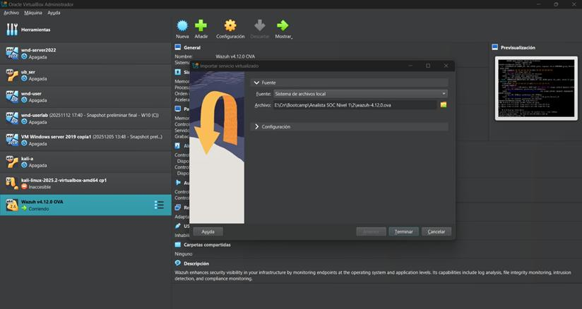
   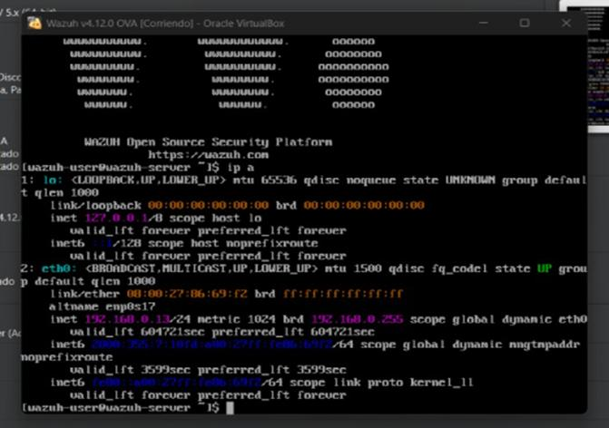

2. **Instalación de agentes** en Windows Server 2019 y Windows 10.

   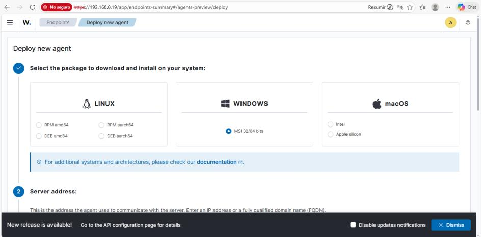

3. **Acceso y configuración del dashboard de Wazuh.**

   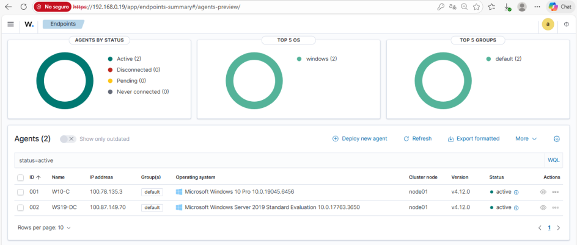
   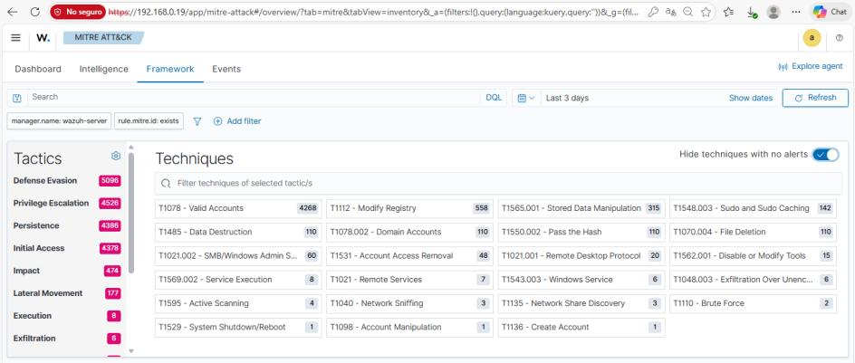

   Tabla de direcciones IPv4 de las máquinas conectadas a la red privada virtual (Tailscale):

   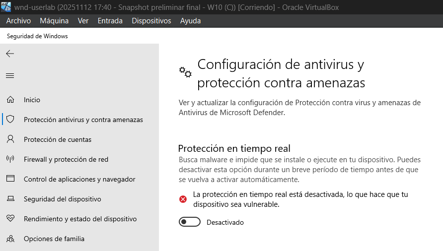
   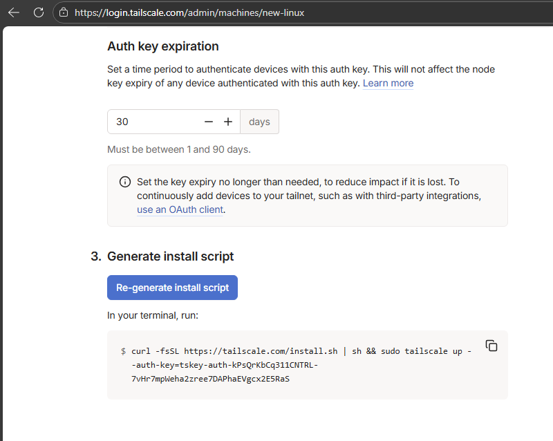

4. **Simulaciones de ataque** en laboratorio controlado.
5. **Pruebas avanzadas** con Atomic Red Team para validar detecciones.

## Técnicas utilizadas

### Reconocimiento y envenenamiento LLMNR/NBT-NS (Responder)
Escaneo inicial con `nmap` y captura de hashes NTLMv2 mediante Responder sobre la interfaz de la tailnet.

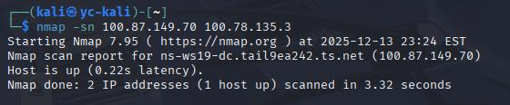
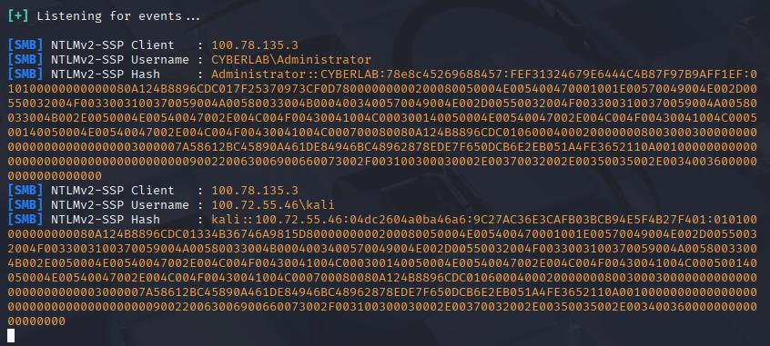

### Password Spraying con CrackMapExec/Hydra
Validación de credenciales contra el DC utilizando CrackMapExec, incluyendo enumeración de grupos de dominio.

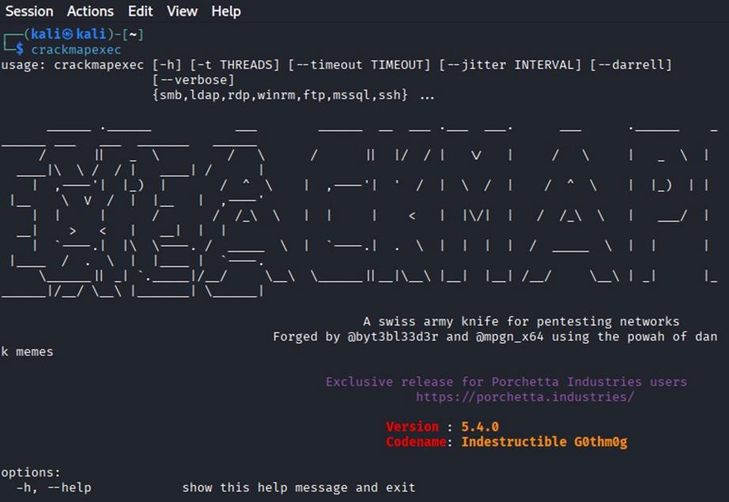

### Kerberoasting con Impacket y John the Ripper
Creación de una cuenta de servicio con SPN, solicitud de tickets TGS con `GetUserSPNs.py` y cracking offline con John.

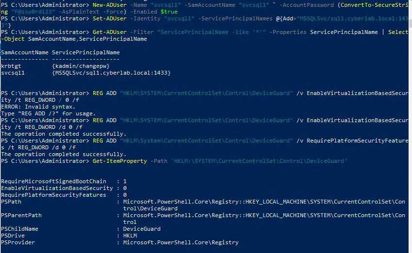
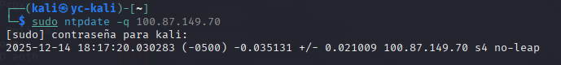
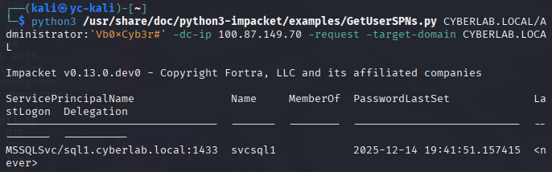

### Recolección de privilegios con BloodHound/SharpHound
Recolección de datos del dominio con SharpHound e importación a BloodHound para mapear rutas de escalamiento de privilegios.

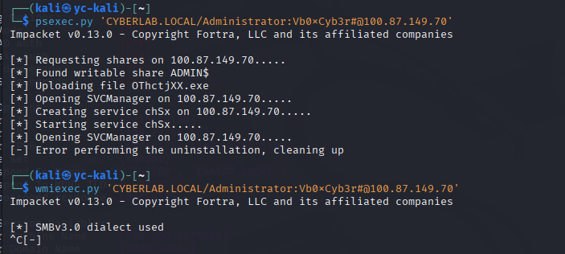
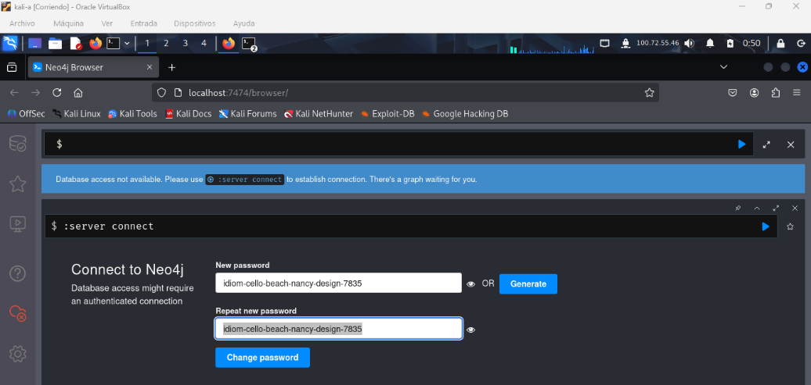

### Movimiento lateral (psexec, wmiexec, smbexec)
Uso de credenciales comprometidas para movimiento lateral y escalamiento de privilegios locales.

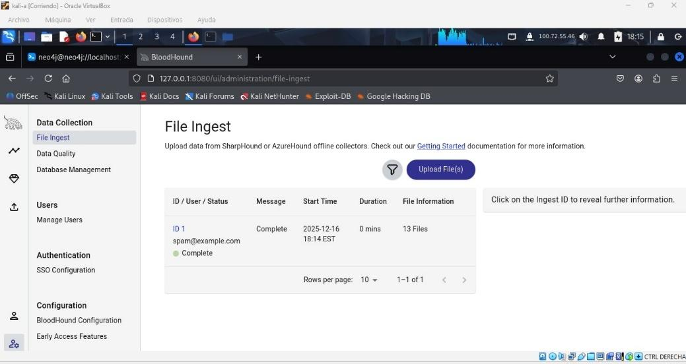

### Credential Dumping con Mimikatz y secretsdump
Extracción de hashes SAM y secretos LSA del controlador de dominio.

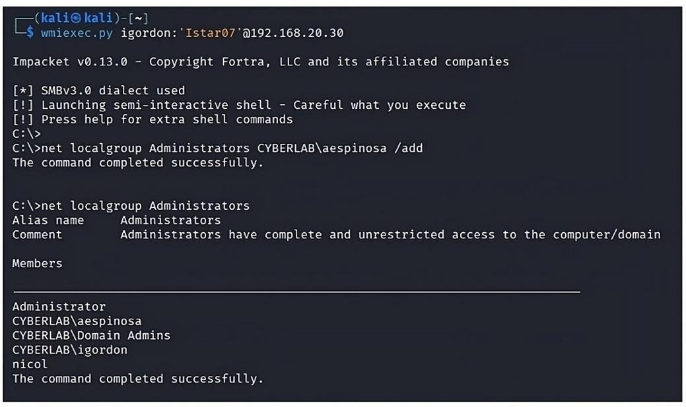

### Ejecución de pruebas atómicas con Atomic Red Team
Pruebas atómicas mapeadas a 10 tácticas de MITRE ATT&CK (TA0043, TA0001, TA0002, TA0003, TA0004, TA0005, TA0006, TA0007, TA0008, TA0010), ejecutadas con el módulo `Invoke-AtomicRedTeam` en PowerShell.

## Detección

- Alertas generadas en Wazuh correlacionadas con eventos de Windows (4625, 4769, 4104, etc.)
- Reglas personalizadas en Sysmon y Wazuh para tácticas críticas (TA0043, TA0010).
- Monitoreo de procesos, conexiones LDAP/RPC y dumps de memoria.

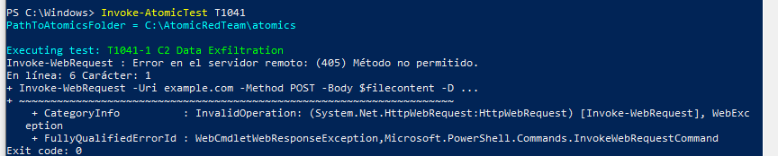

## Mitigación

- Deshabilitar LLMNR y NetBIOS vía GPO.
- Políticas de contraseñas fuertes y MFA.
- Restricción de privilegios en cuentas de servicio.
- Segmentación de red y filtrado de tráfico.
- Auditoría de tareas programadas y claves de registro.
- Protección de credenciales (Credential Guard, EDR).
- Hardening de políticas de AD y GPO.

## Aprendizaje

- Comprensión práctica del ciclo de ataque y defensa en entornos corporativos.
- Validación de la capacidad de detección de un SIEM frente a técnicas MITRE ATT&CK.
- Importancia del tuning de reglas para reducir falsos positivos.
- Relevancia de combinar detección, mitigación y monitoreo continuo para fortalecer la postura de seguridad.

## Referencias

- [Wazuh – Instalación oficial](https://wazuh.com/install/)
- [Atomic Red Team – GitHub](https://github.com/redcanaryco/atomic-red-team)
- [MITRE ATT&CK Framework](https://attack.mitre.org/)
- [Invoke-AtomicRedTeam Docs](https://www.atomicredteam.io/invoke-atomicredteam/docs)
