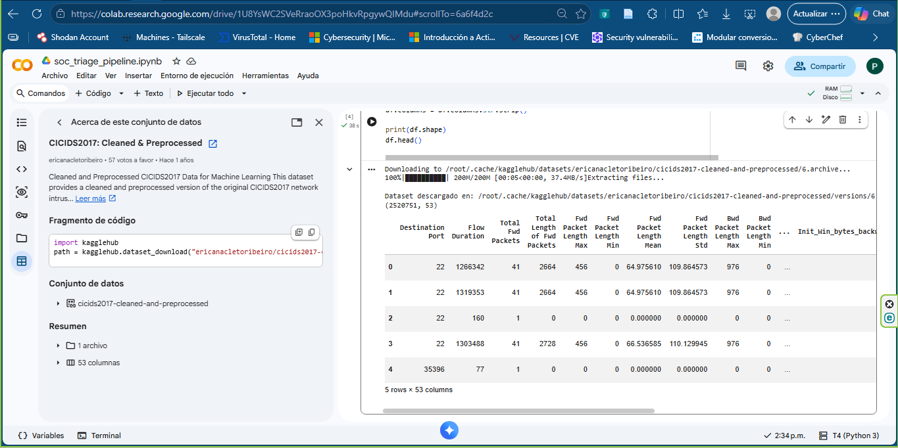
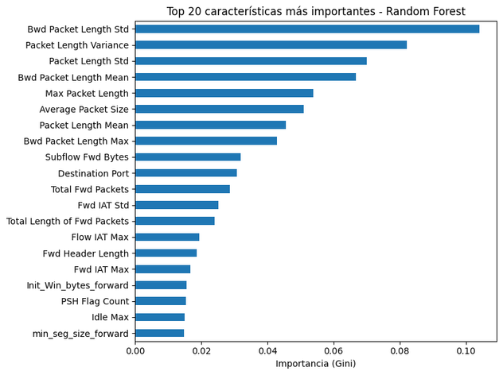
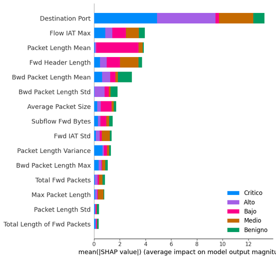
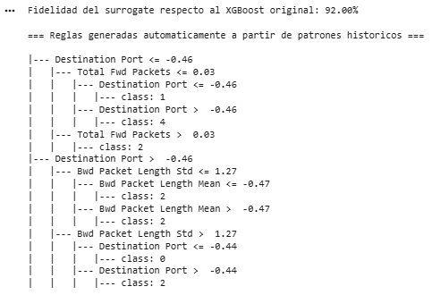
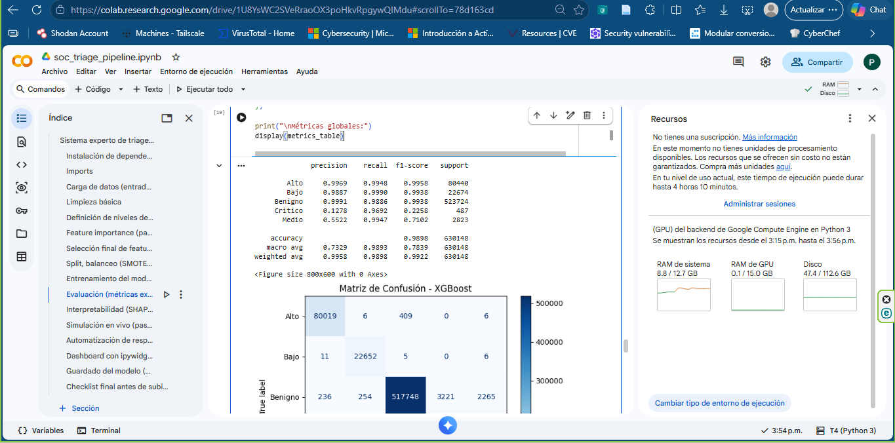
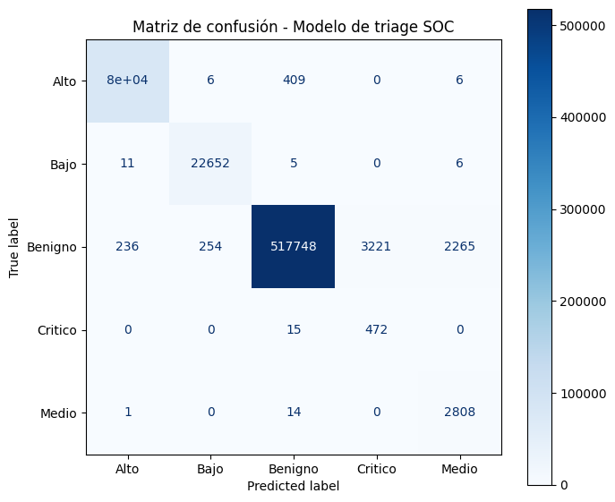
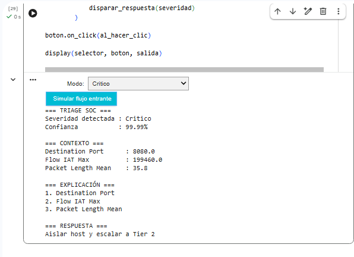

# Sistemas Expertos en Centros de Operaciones de Seguridad (SOC)

**Entrenamiento, generación y automatización de reglas expertas para el triaging inteligente de alertas**

Proyecto semestral · Tema 6 · Licenciatura en Ciberseguridad — IA Aplicada a la Ciberseguridad
Universidad Tecnológica de Panamá (UTP-FISC)


---

## 📌 Descripción

Un analista SOC Tier 1 puede recibir hasta 1,000 alertas diarias, la mayoría falsos positivos. Este proyecto demuestra cómo un **sistema experto basado en reglas**, combinado con un modelo de **Machine Learning (XGBoost)**, puede automatizar el *triaging* de alertas de seguridad, priorizando lo que realmente importa y reduciendo el *alert fatigue*.

El *pipeline* combina:
- Un **clasificador XGBoost** entrenado sobre tráfico de red real (dataset CIC-IDS2017).
- Un **árbol *surrogate*** (profundidad 3) que aproxima al XGBoost con **92% de fidelidad**, generando reglas legibles tipo `if/then` exportables a formato **Sigma (YAML)**.
- Explicabilidad vía **SHAP**, para justificar cada predicción.
- Un **dashboard interactivo** (ipywidgets) que simula la clasificación de alertas en vivo.

---

## 🏗️ Arquitectura de la solución

```
Fuentes de alertas (Sysmon / SIEM / XDR / IDS)
        ↓
Preprocesamiento (normalización, parsing)
        ↓
   ┌────────────┬───────────────┐
   ↓            ↓
Motor de reglas         Modelo ML
(Sigma/Wazuh/Splunk)     (XGBoost, batch sobre CIC-IDS2017)
   └────────────┴───────────────┘
        ↓
Priorización (score de criticidad)
        ↓
SOAR: playbook automático y escalamiento a analista
```

---

## 📊 Dataset

- **Fuente:** [CIC-IDS2017](https://www.unb.ca/cic/datasets/ids-2017) (vía Kaggle, versión limpia/preprocesada) — dataset público de tráfico de red, no sintético.
- **Volumen:** 2,520,590 flujos de red depurados · 53 columnas.
- **Conjunto de prueba:** ~630,000 flujos (25%), exactitud global ~99%.
- **Justificación ética:** dataset público, anonimizado, generado en laboratorio por el Canadian Institute for Cybersecurity.

<p align="center">
  
</p>
<p align="center"><em>Salida de <code>head()</code> del DataFrame en Google Colab, tras la limpieza (2,520,590 filas × 53 columnas).</em></p>

---

## ⚙️ Procesamiento: clasificador XGBoost y reglas derivadas

- **XGBoost** entrenado con flujos etiquetados por severidad (Benigno → Crítico); un **Random Forest** se usa únicamente para seleccionar *features* relevantes (importancia Gini).
- Variables de mayor impacto: `Destination Port`, `Flow IAT Max`, `Packet Length Mean`.

<p align="center">
  
</p>
<p align="center"><em>Top 20 características más importantes según Random Forest.</em></p>

- Las reglas se generan automáticamente a partir de un **árbol *surrogate*** que imita al XGBoost con **92% de fidelidad**, produciendo condiciones `if/then` legibles (severidad final por rama).

<p align="center">
  
</p>
<p align="center"><em>Reglas generadas automáticamente a partir del árbol surrogate (condición → severidad).</em></p>

- **Explicabilidad (SHAP):** confirma qué variables pesan más en cada predicción, por clase de severidad.

<p align="center">
  
</p>
<p align="center"><em>SHAP como evidencia de explicabilidad del modelo, por clase de severidad.</em></p>

---

## 📈 Resultados y métricas del modelo

| Métrica | Valor obtenido |
|---|---|
| Accuracy | 0.9898 |
| Precisión (Precision) | 0.9958 |
| Exhaustividad (Recall) | 0.9898 |
| F1-score | 0.9922 |
| AUC | 0.9997 |

<p align="center">
  
</p>
<p align="center"><em>Matriz de confusión — desempeño real del modelo de triage SOC.</em></p>

<p align="center">
  
</p>
<p align="center"><em>Classification report por clase (precisión, recall, F1-score, soporte).</em></p>

> ⚠️ **Nota crítica:** el *recall* en la clase **Crítico** es alto (0.97), pero su precisión es baja (0.13) — el modelo prioriza deliberadamente **no perder incidentes críticos**, a costa de más falsos positivos en esa categoría. Esta es una decisión de diseño consciente, alineada con el principio de minimizar falsos negativos en seguridad.

---

## 🖥️ Simulación en vivo

Dashboard interactivo (ipywidgets) que procesa flujos de red uno a uno y muestra: severidad detectada, nivel de confianza, contexto (variables clave) y explicación basada en SHAP, junto con la acción de respuesta sugerida.

<p align="center">
  
</p>
<p align="center"><em>Ejemplo de clasificación en vivo: severidad "Crítico" con 99.99% de confianza y recomendación de aislar host y escalar a Tier 2.</em></p>

---

## 📁 Contenido del repositorio

- `IAAC_PF_T6.pdf` — presentación completa de la sustentación.
- `extract_pdf_to_project.py` — script para extraer imágenes embebidas de un PDF (usado para generar las capturas de este README).
- `screenshots/` — capturas seleccionadas del notebook, usadas en esta documentación.
- `capturas/` — todas las imágenes extraídas del PDF (incluye logos y elementos menores).

## 🎓 Fundamentos de IA aplicados al SOC

| Enfoque | Rol en el proyecto |
|---|---|
| **Sistemas basados en reglas** | Lógica `if/then` de alta explicabilidad, base del triaging automatizado. |
| **Aprendizaje supervisado** | Clasificación de alertas (XGBoost) entrenada con datos históricos etiquetados. |
| **Aprendizaje no supervisado** | Detección de anomalías (ej. Isolation Forest) para patrones nunca antes vistos. |
| **LLMs / IA generativa** | Apoyo en generación de reglas Sigma y explicación de alertas en lenguaje natural. |

---

## ⚖️ Limitaciones y consideraciones éticas

- **Human-in-the-Loop:** las decisiones críticas no deben depender exclusivamente del modelo automatizado; los analistas deben validar acciones de alto impacto.
- **Sesgo y calidad de datos:** modelos entrenados con datos incompletos o sesgados pueden producir clasificaciones incorrectas; requiere evaluación continua.
- **Transparencia:** la falta de explicabilidad genera desconfianza operativa (mitigado aquí con reglas *surrogate* + SHAP).
- **Privacidad:** los sistemas de IA en el SOC procesan datos sensibles (IPs, eventos de red); se debe aplicar minimización de datos y acceso controlado.

---

## 🔭 Líneas futuras

- Sistemas híbridos que integren reglas explicables con modelos adaptativos.
- *Knowledge Graphs* y *Graph Neural Networks* para correlación avanzada de alertas.
- *Multi-Agent Systems* en el SOC: agentes especializados colaborando en investigación, clasificación y respuesta automática.

---

## 📚 Referencias principales

- Goud, K. N., Jain, K., & Krishnan, P. (2026). *A Semi-Supervised and Evasion-Aware Framework for Reducing Alert Fatigue in Security Operations Centers (SoC)*.
- Priyanka, P. et al. (2026). *Large Language Model SOC Automation: Future Opportunity and Threats of AI-Approved Defense*.
- McElwee, S., Heaton, J., Fraley, J., & Cannady, J. (2017). *Deep learning for prioritizing and responding to intrusion detection alerts*.
- Sharbaf, M. S. (2026). *Reengineering Cybersecurity Processes with Generative AI: From Automation to Strategic Alignment*.
- MITRE ATT&CK (2026). *MITRE ATT&CK Matrix for Enterprise*. https://attack.mitre.org/
- SigmaHQ (2023). *Sigma: Generic signature format for cyber security detection mechanisms*. https://github.com/sigmahq/sigma
- NIST (2025). *Cybersecurity Framework Profile for Artificial Intelligence (NIST IR 8596)*.
- University of New Brunswick (2017). *CIC-IDS2017 Dataset*. https://www.unb.ca/cic/datasets/ids-2017

---

Repositorio: https://github.com/yahna-chee/yahnachee.github.io/tree/main/IA/soc_project
