# 🔐 ZTUTP Soluciones — Implementación de Red Wi-Fi Zero Trust

> **Caso de estudio académico:** diseño e implementación de una arquitectura **Zero Trust** para una WLAN corporativa, desarrollado en tres fases — desde el análisis teórico de la superficie de ataque hasta un laboratorio funcional con **pfSense + Cloudflare Zero Trust**.

**Universidad Tecnológica de Panamá** · Facultad de Ingeniería en Sistemas Computacionales · Licenciatura en Ciberseguridad · Asignatura Ciberseguridad III

---

## 📋 Tabla de Contenidos

- [Resumen del proyecto](#-resumen-del-proyecto)
- [Parte I — Análisis y prototipo conceptual](#parte-i--análisis-y-prototipo-conceptual)
- [Parte II — Prototipo en Packet Tracer](#parte-ii--prototipo-en-packet-tracer)
- [Parte III — Laboratorio real (pfSense + Cloudflare)](#parte-iii--laboratorio-real-pfsense--cloudflare)
- [Evidencia de pruebas](#-evidencia-de-pruebas)
- [Stack de herramientas](#-stack-de-herramientas)
- [Principios NIST SP 800-207 aplicados](#-principios-nist-sp-800-207-aplicados)
- [Conclusiones](#-conclusiones)
- [Referencias](#-referencias)

---

## 🎯 Resumen del proyecto

El caso de estudio simula a **ZTUTP Soluciones**, una empresa ficticia de ciberseguridad, encargada de modernizar la infraestructura de un cliente con **500 empleados** y una superficie de ataque expuesta por dispositivos BYOD y accesos Wi-Fi sin control de identidad.

El objetivo fue eliminar el modelo de **confianza implícita** y reemplazarlo por verificación continua, aplicando los principios de **NIST SP 800-207**, en tres etapas incrementales:

| Parte | Enfoque | Entregable |
|---|---|---|
| **I** | Análisis de superficie de ataque + diseño conceptual | Arquitectura Zero Trust de alto nivel |
| **II** | Prototipo simulado | Topología funcional en **Cisco Packet Tracer** (802.1X, RADIUS, ACLs) |
| **III** | Implementación real | Laboratorio con **pfSense**, **Docker**, **Cloudflare Tunnel** y **Cloudflare Access** |

---

## Parte I — Análisis y prototipo conceptual

Se identificaron tres áreas críticas de exposición: servidores financieros, dispositivos BYOD y los puntos de acceso Wi-Fi. A partir de ahí se modeló el ciclo de vida del ataque (descubrimiento → infiltración → movimiento lateral) y se diseñó una arquitectura de referencia con **Gateway ZTNA**, **IAM**, **MFA** y **MDM/EDR** como plano de control.

  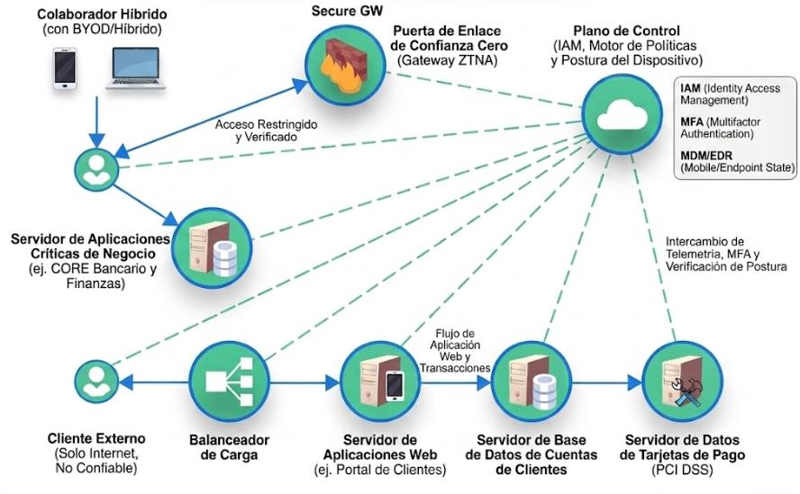
   <em>Arquitectura propuesta: flujo interno (BYOD) y flujo externo (cliente no confiable)</em>

  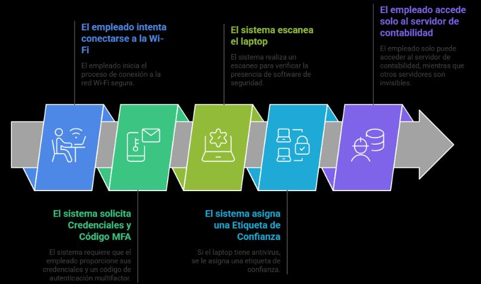
   <em>Flujo de acceso Zero Trust paso a paso para un dispositivo BYOD</em>

---

## Parte II — Prototipo en Packet Tracer

Se construyó una WLAN 802.1X con autenticación **RADIUS/AAA**, segmentación por VLANs y **ACLs de microsegmentación** que bloquean el movimiento lateral entre el segmento BYOD, los servidores y el plano de control.

  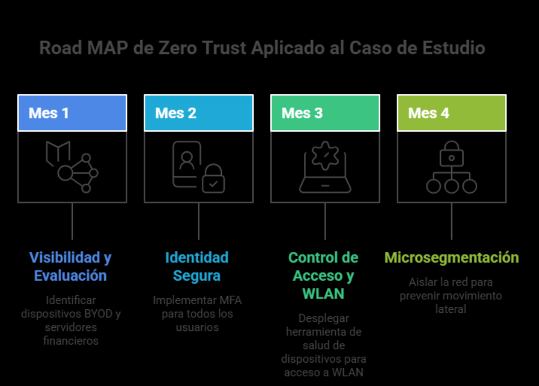
   <em>Roadmap de implementación en 4 fases (visibilidad → identidad → NAC → microsegmentación)</em>

  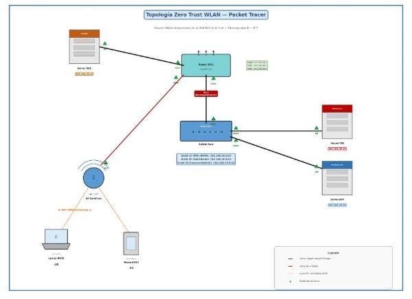
   <em>Topología final en Packet Tracer: Router-Core, Switch-Core, WLC, AP, servidor RADIUS y servidores segmentados por VLAN</em>

**Resultado de las pruebas de segmentación:**

| Escenario | Origen → Destino | Resultado |
|---|---|---|
| A | Laptop BYOD → Router (gateway VLAN) | ✅ Ping exitoso |
| B | Laptop BYOD → Servidor Financiero | ⛔ `Destination host unreachable` |
| C | Laptop BYOD → Servidor RADIUS (plano de control) | ⛔ `Destination host unreachable` |

---

## Parte III — Laboratorio real (pfSense + Cloudflare)

La fase final llevó el concepto a un entorno real y funcional, **sin DMZ**, demostrando que en Zero Trust la protección depende de la **identidad y la política**, no de la ubicación del recurso en la red.

  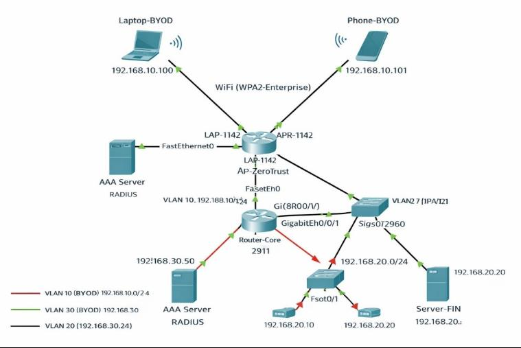
   <em>Topología simplificada: pfSense como firewall deny-by-default y Ubuntu Server con Docker (Nginx + cloudflared)</em>

  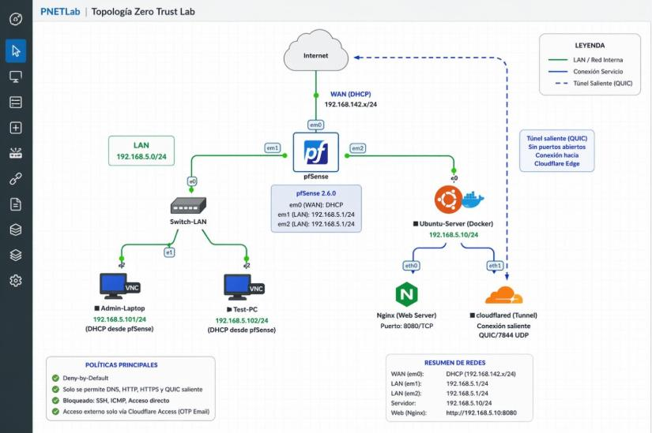
   <em>Diagrama detallado del laboratorio en PNETLab: reglas deny-by-default y resumen de redes</em>

  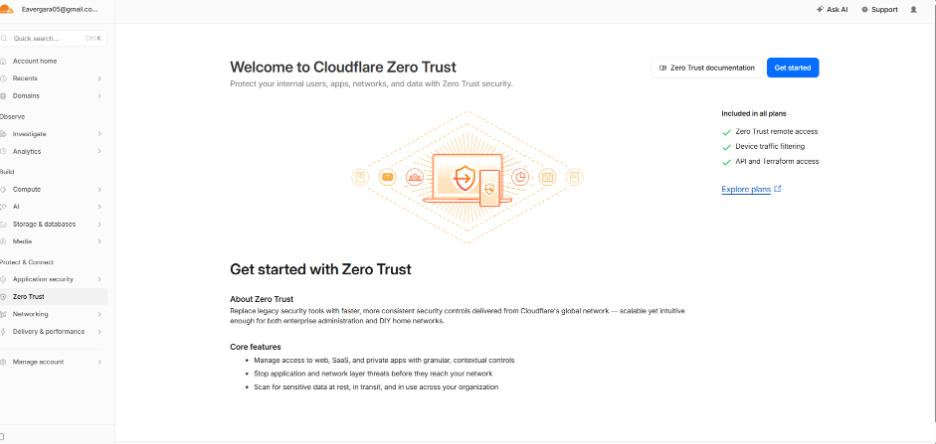
   <em>Panel "Get started with Zero Trust" en Cloudflare, punto de partida de la capa ZTNA</em>

  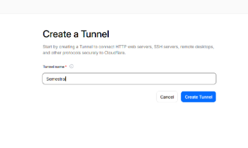
   <em>Creación del Cloudflare Tunnel usado para publicar el servidor sin abrir puertos</em>

---

## ✅ Evidencia de pruebas

Seis pruebas validaron el comportamiento **deny-by-default** del laboratorio real:

  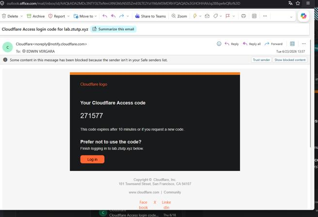
   <em>Prueba 1 — Acceso autorizado: código OTP enviado por Cloudflare Access</em>

  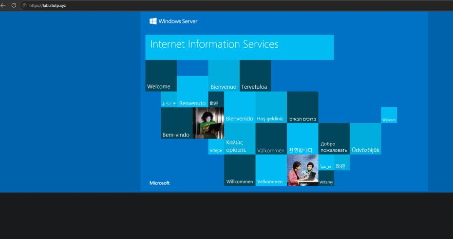
   <em>Prueba 1 — Portal visible únicamente tras superar la verificación de identidad</em>

  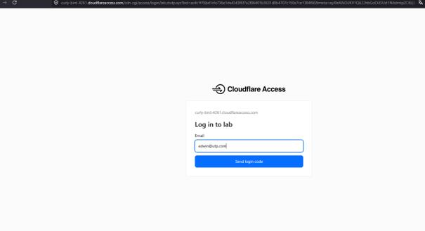
   <em>Prueba 2 — Acceso no autorizado: Cloudflare Access deniega el login</em>

  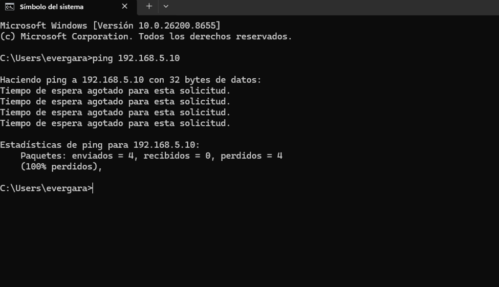
   <em>Prueba 4 — Movimiento lateral bloqueado: ping desde la LAN hacia el servidor (100% perdido)</em>

  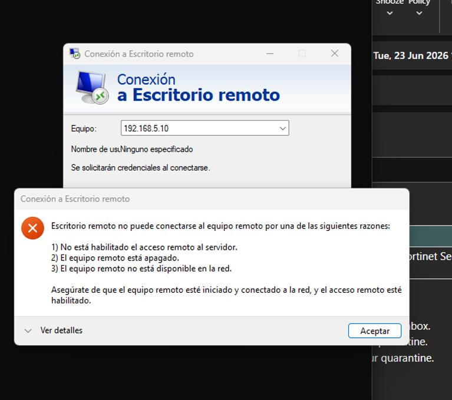
   <em>Prueba 4 — Intento de Escritorio Remoto (RDP) rechazado por las reglas deny-by-default de pfSense</em>

| # | Prueba | Resultado esperado |
|---|---|---|
| 1 | Acceso autorizado con OTP | ✅ Acceso concedido |
| 2 | Acceso no autorizado | ⛔ Access Denied |
| 3 | Acceso directo al servidor (nmap) | ⛔ Puertos filtrados/cerrados |
| 4 | Movimiento lateral (ping/RDP/SSH) | ⛔ Bloqueado por pfSense |
| 5 | Solo servicio autorizado (curl) | ✅ Solo responde vía túnel Cloudflare |
| 6 | Revocación y expiración de sesión | ⛔ Re-autenticación requerida |

---

## 🛠 Stack de herramientas

| Componente | Herramienta | Función |
|---|---|---|
| Firewall | pfSense CE 2.6.0 | Segmentación, deny-by-default, NAT |
| Servidor Web | Nginx (Docker) | Aplicación interna protegida |
| Túnel Zero Trust | cloudflared (Docker) | Conexión saliente cifrada, sin puertos abiertos |
| Control de acceso | Cloudflare Access | Autenticación por identidad + OTP |
| IAM (prototipo) | Keycloak | Gestión centralizada de identidades |
| MFA | Google Authenticator / privacyIDEA | Verificación multifactor |
| MDM/EDR | OpenEDR / Wazuh | Monitoreo de postura del dispositivo |
| Microsegmentación (real) | OPNsense / pfSense | Aislamiento por segmento |
| SO / contenedores | Ubuntu Server 22.04 + Docker Compose | Host de servicios |

---

## 📐 Principios NIST SP 800-207 aplicados

- **Deny-by-Default** — todo el tráfico se bloquea salvo regla o política explícita.
- **Acceso basado en identidad con MFA** — autenticación obligatoria antes de cualquier acceso.
- **Mínimo privilegio** — el túnel solo expone el recurso específico autorizado, nunca la red completa.
- **Verificación continua y expiración de sesión** — sesiones de 15 minutos con revocación inmediata.

---

## 🧾 Conclusiones

El laboratorio demostró que una arquitectura Zero Trust completa puede implementarse con **herramientas gratuitas y de código abierto**, con un costo total cercano a **$1 USD/año** (solo el dominio). La eliminación intencional de la DMZ confirmó el principio central del modelo: la ubicación del recurso en la red no determina su confianza — la protección depende de la identidad verificada y la política aplicada en cada solicitud.

---

## 📚 Referencias

- Rose, S., Borchert, O., Mitchell, S., & Connelly, S. (2020). *Zero Trust Architecture*. NIST SP 800-207. https://csrc.nist.gov/pubs/sp/800/207/final
- Cloudflare, Inc. (2026). *Cloudflare Zero Trust Documentation*. https://developers.cloudflare.com/cloudflare-one/
- Netgate. (2026). *pfSense Documentation*. https://docs.netgate.com/pfsense/en/latest/
- Mazebolt. (2025). *Zero trust model security challenges*. https://mazebolt.com/blog/zero-trust-security-challenges
- CISA. (2023). *Zero Trust Maturity Model*. https://www.cisa.gov/zero-trust-maturity-model

---

<em>Proyecto académico — Ciberseguridad III, Universidad Tecnológica de Panamá.</em>

