# AD-CS Pentesting & Hardening — Semester Project

## Overview

This project evaluates the security of an **Active Directory Certificate Services (AD-CS)** environment built manually on **Windows Server 2019**. The original plan was to use a preconfigured vulnerable OVA lab, but due to technical issues the team rebuilt the same intentional misconfigurations from scratch on a fresh Domain Controller — vulnerable certificate templates, weak permissions, and insecure CA settings.

The work was carried out in three phases:

1. **Environment setup** — deploying a Domain Controller with AD-CS and importing vulnerable certificate templates, test users, and firewall rules.
2. **Security assessment** — enumerating the PKI, then exploiting **ESC1, ESC2, ESC3, ESC4, ESC7**, and a **PKINIT "Golden Certificate"** attack to obtain Domain Admin credentials.
3. **Mitigation** — hardening the templates and CA, disabling Web Enrollment, restricting NTLM, and validating that every attack path was closed.

---

## Lab Topology

- **Domain:** `CYBERLAB.LOCAL`
- **CA:** `cyberlab-DC01-CYBER-CA` (hosted on the WS19 Domain Controller)
- **Attacker box:** Kali Linux (`certipy`, `netexec`, `evil-winrm`, `impacket`)
- **Low-privilege user:** `s.jackson`
- **Secondary test user (ESC7):** `m.roland`

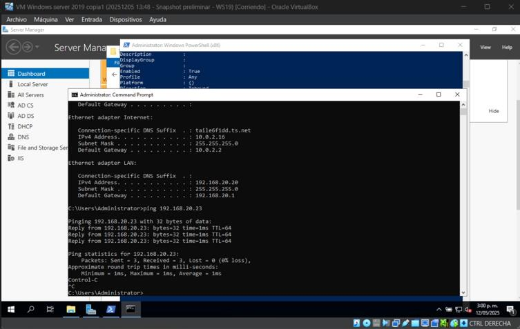
*Connectivity check between the Kali attacker machine and the WS19 Domain Controller.*

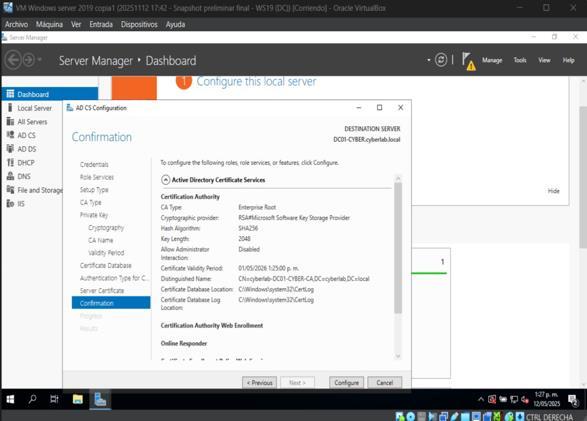
*Configuring the AD-CS role during environment setup.*

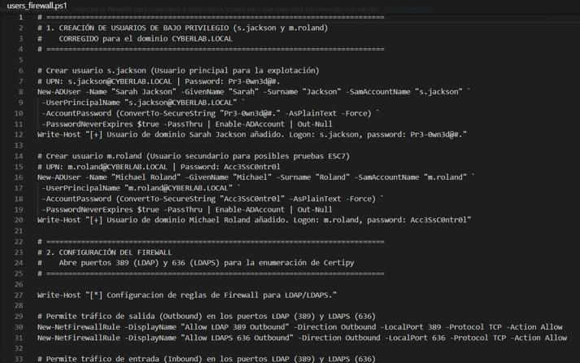
*PowerShell scripts used to download vulnerable template definitions, create `s.jackson` and `m.roland`, and open the ports needed for Certipy enumeration.*

---

## Initial Enumeration

Using the low-privilege account `s.jackson`, the team ran `certipy find` against the CA to map every certificate template, its permissions, and its enabled Extended Key Usages.

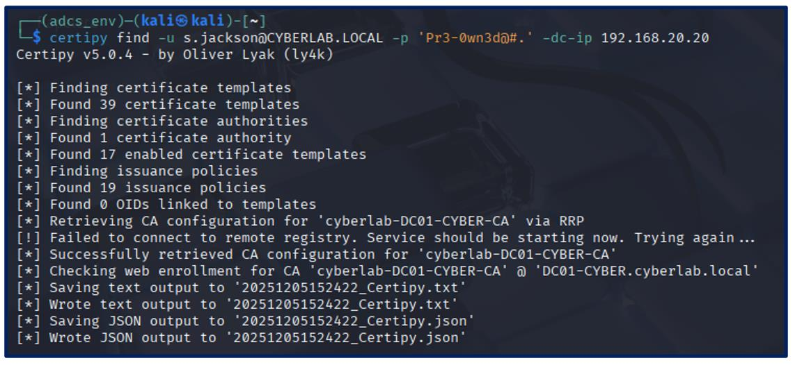
*Certipy discovers 39 templates, 1 CA, and 17 enabled templates on `cyberlab-DC01-CYBER-CA`.*

Certipy flagged the injected `Vuln-ESC1` template as **Vulnerable: Yes**, because it combines the `ENROLLEE_SUPPLIES_SUBJECT` flag with an `Enroll` right granted to `Domain Users`.

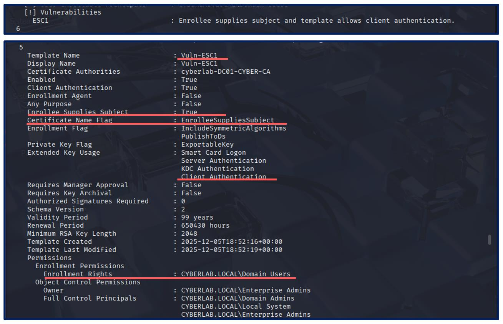
*Certipy output confirming the ESC1 vulnerability on `Vuln-ESC1`.*

---

## Attack Chain

### ESC1 — Misconfigured certificate template

**Root cause:** the template lets the requester supply an arbitrary Subject Alternative Name (SAN) while allowing Client Authentication and Domain-User enrollment.

`s.jackson` requested a certificate for `Vuln-ESC1`, specifying the Administrator's UPN in the SAN field, then used the resulting `.pfx` to authenticate via PKINIT and retrieve the Domain Administrator's NTLM hash.

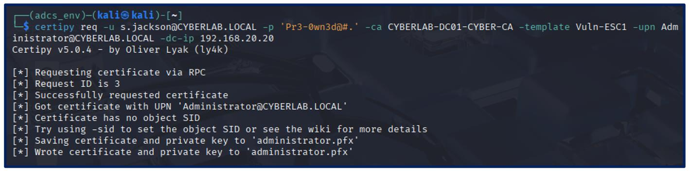
*Certipy requests a certificate on behalf of `Administrator@CYBERLAB.LOCAL`, exploiting `Vuln-ESC1`.*

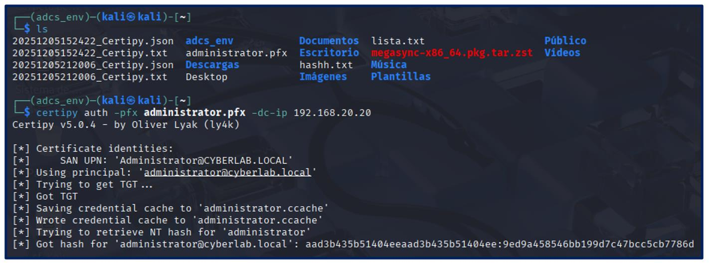
*PKINIT authentication with the stolen certificate returns the Domain Administrator's NTLM hash.*

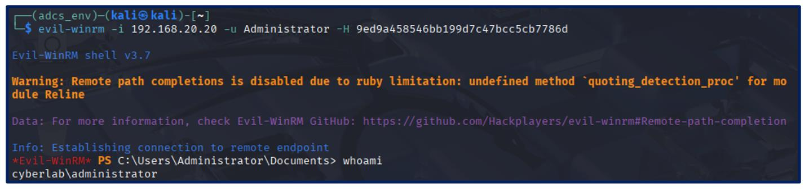
*Pass-the-Hash login via `evil-winrm`, confirming full Domain Admin access.*

### ESC2 — Template with an "Any Purpose"/enrollment-agent EKU

`Vuln-ESC2` grants `Enroll` to Domain Users and carries an EKU that lets the holder act as an **enrollment agent**, i.e. request certificates *on behalf of* other users.

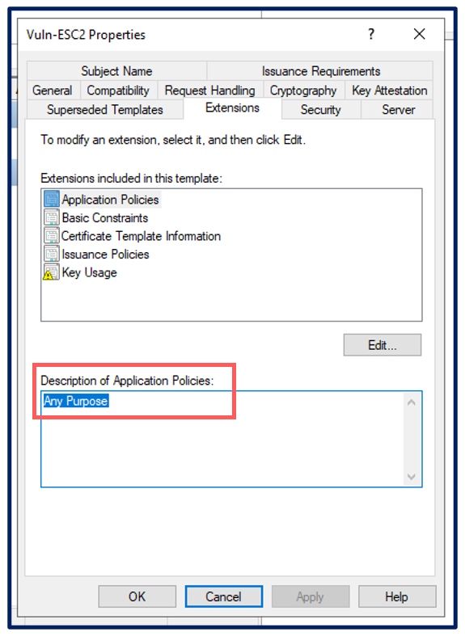
*The template's EKU is set to Any Purpose, enabling enrollment-agent abuse.*

`s.jackson` first obtained an agent certificate, then used it to request a `User` certificate `-on-behalf-of 'CYBERLAB\Administrator'`, and finally authenticated with PKINIT to dump the Administrator's hash.

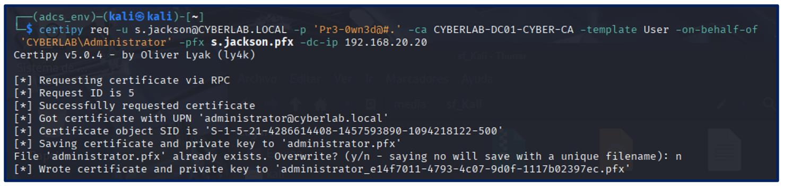
*Certificate for the Administrator issued through the stolen enrollment-agent identity.*

### ESC3 — Misconfigured enrollment-agent templates

Two chained templates (`Vuln-ESC3-1`, `Vuln-ESC3-2`) both grant `Enroll` to Domain Users and carry the **Certificate Request Agent** EKU, letting a low-privilege user request an agent certificate and then impersonate the Administrator through the second template.

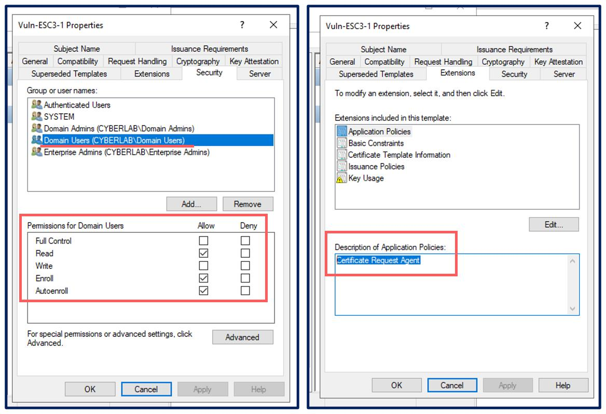
*Domain Users hold Enroll/Autoenroll rights, and the Certificate Request Agent application policy is present.*

The chain ends the same way as ESC1/ESC2: a forged Administrator certificate, PKINIT authentication, NTLM hash extraction, and an `evil-winrm` shell as `CYBERLAB\Administrator`.

### ESC4 — Weak template ACL (Write permission)

`Vuln-ESC4`'s DACL originally lacked the `Write` permission the lab required, so the team granted `Authenticated Users` Write access manually to reproduce the intended scenario. With that permission, `s.jackson` reconfigured the template itself — enabling Client Authentication and `ENROLLEE_SUPPLIES_SUBJECT` — turning a previously safe template into an ESC1-style vector.

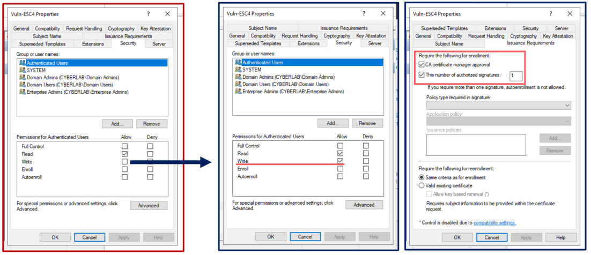
*Root cause: Authenticated Users hold the Write permission on the template's DACL.*

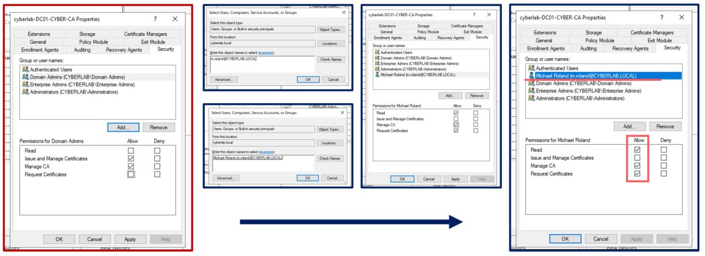
*Certipy abuses the Write permission to add the dangerous flags to the template configuration.*

The attacker then requested a certificate with `-upn administrator@CYBERLAB.LOCAL -sid <Domain Admin SID>`, authenticated via PKINIT, dumped the hash, and confirmed access with `impacket-secretsdump` and `evil-winrm`.

### ESC7 — Vulnerable CA access control (Manage CA)

The account `m.roland` was granted the **Manage CA** right directly on the Certificate Authority object — a critical ACL misconfiguration.

*`m.roland` has Read and Manage CA rights on `cyberlab-DC01-CYBER-CA`.*

Using `certipy ca -add-officer`, the attacker escalated from Manage CA to **Manage Certificates**, enabled the dangerous `SubCA` template, submitted a request for the Administrator UPN (which the CA initially denied), and then force-issued the pending request with `-issue-request`. The resulting certificate was retrieved, used for PKINIT, and converted into full Domain Admin access.

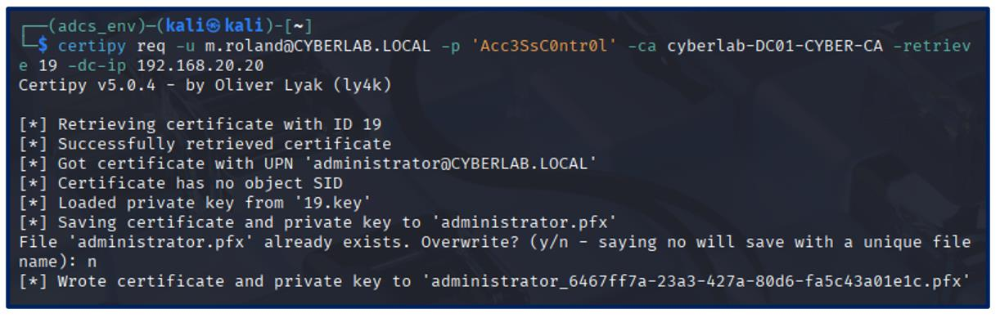
*Manage Certificates rights are used to flip the pending request to "Issued."*

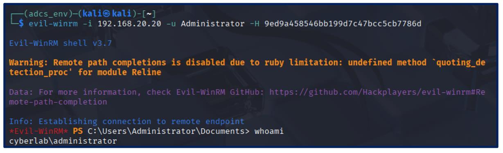
*Certipy retrieves the NTLM hash after authenticating with the forcibly issued certificate.*

### PKINIT — "Golden Certificate"

The most severe attack: once an account with Domain Admin rights (`m.roland`, escalated above) can reach the CA server, its **CA private key** can be backed up and stolen with `certipy ca -backup`. That key lets an attacker **forge** certificates for any principal — including the DC's machine account — without ever touching the CA's issuance workflow again, similar in spirit to a Golden Ticket.

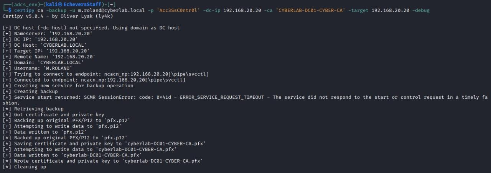
*The CA's PFX (certificate + private key) is exported from the Domain Controller.*

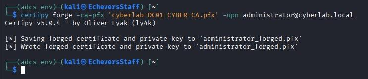
*A brand-new certificate for `administrator@cyberlab.local` is forged offline using the stolen CA key — no interaction with the CA server is required.*

---

## Mitigations Applied

| Vulnerability | Hardening measure | Attacks mitigated |
|---|---|---|
| Weak template ACL (Write/Enroll) | Principle of Least Privilege: remove Write/Enroll from low-privilege groups (Authenticated Users, Domain Users) | ESC1, ESC2, ESC3-1, ESC4 |
| Impersonation flags | Disable `CT_FLAG_ENROLLEE_SUPPLIES_SUBJECT` unless strictly required | ESC1, ESC3-1, ESC4 |
| Dangerous EKUs | Restrict Client Authentication / Any Purpose EKUs behind manager approval or agent restrictions | ESC1, ESC2, ESC3-1, ESC3-2, ESC4 |
| Weak CA ACL | Remove Manage CA / Manage Certificates from non-PKI-admin accounts | ESC7 |
| Enrollment agent abuse | Enforce the Enrollment Agent restriction feature | ESC2 |
| Web Enrollment attack surface | Uninstall the Web Enrollment role, or restrict ports 80/443 to PKI admins | NTLM relay via IIS |
| NTLM as a credential | Deny inbound/outbound NTLM via GPO on the DC/CA, force NTLMv2-only | PKINIT/Golden Certificate, Pass-the-Hash |

Every attack was re-tested after remediation and **failed as expected** (`CERTSRV_E_TEMPLATE_DENIED`, `Access denied`, `RPC_E_CALL_COMPLETE`, etc.).

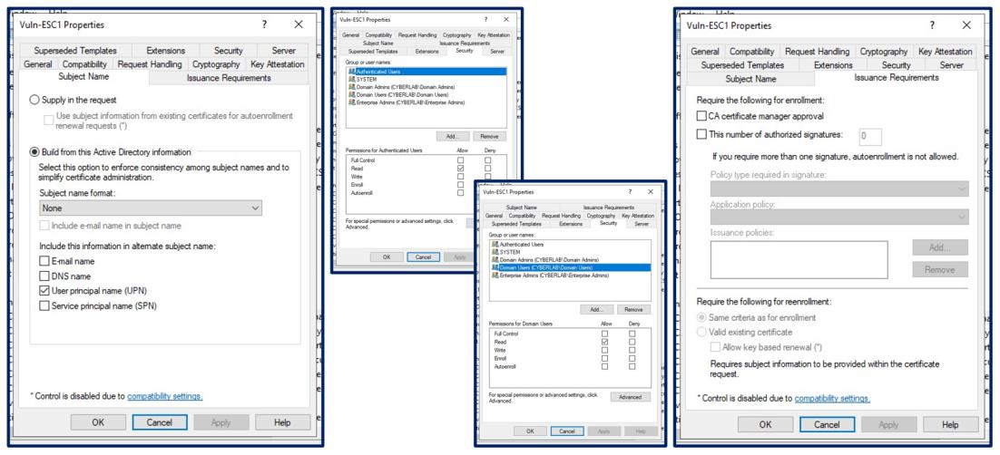
*Post-hardening validation: the ESC1 request is rejected by the CA.*

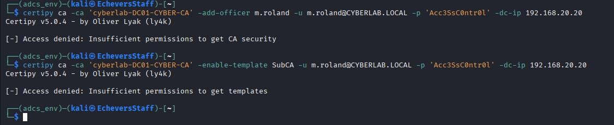
*Post-hardening validation: `add-officer` and template enablement are denied due to insufficient permissions.*

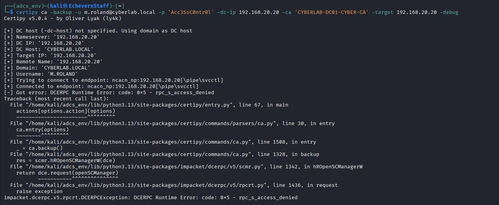
*Post-hardening validation: the CA backup operation is denied (`rpc_s_access_denied`).*

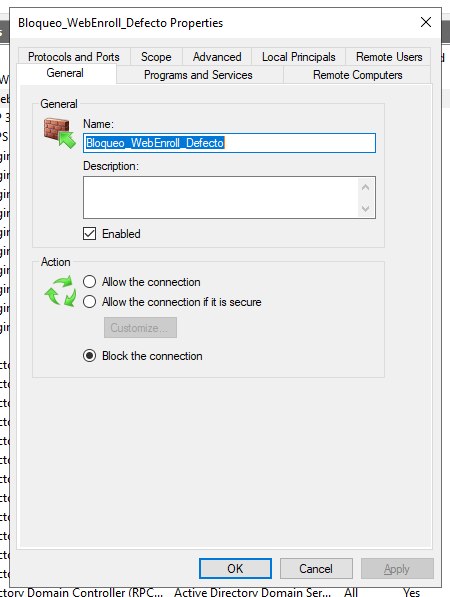
*`certipy find` now reports Web Enrollment HTTP/HTTPS as disabled and `User Specified SAN: Disabled`.*

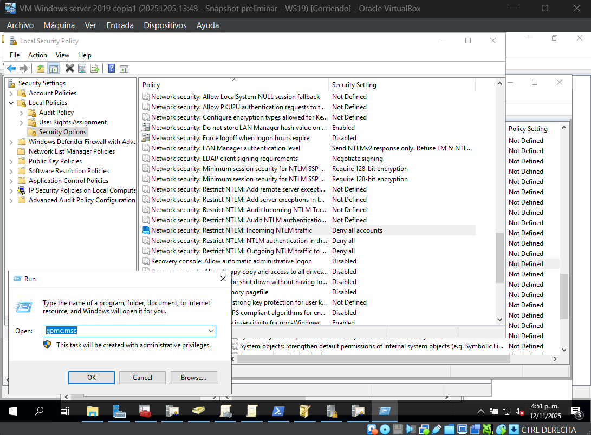
*Group Policy configured to deny inbound and outbound NTLM traffic, forcing Kerberos-only authentication.*

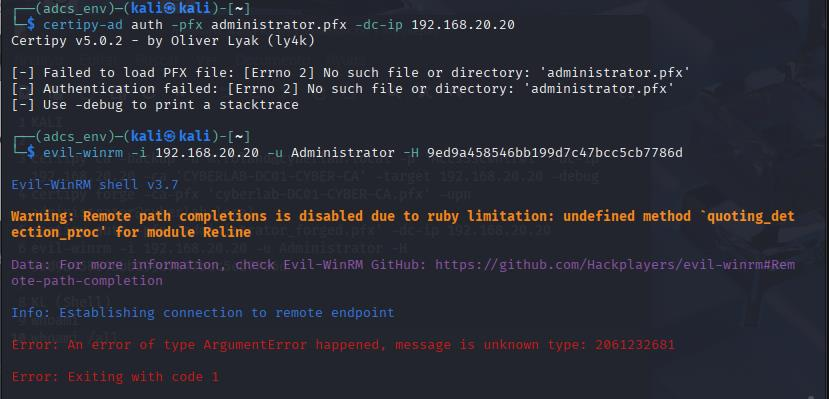
*The previously valid NTLM hash can no longer be used to open an `evil-winrm` shell.*

---

## Key Takeaways

- The **theoretical strength of certificate cryptography is irrelevant** if templates, permissions, or CA access controls are misconfigured — ESC1 through ESC7 and PKINIT abuse are administrative failures, not cryptographic breaks.
- **Least privilege on certificate templates** (Enroll, Write, Autoenroll) is the single highest-leverage control; it closes ESC1, ESC2, ESC3, and ESC4 simultaneously.
- **CA-level access control** (Manage CA / Manage Certificates) deserves the same scrutiny as Domain Admin group membership — ESC7 shows a single misassigned right can compromise the entire domain.
- **NTLM restriction and Web Enrollment removal** are defense-in-depth layers: even if a template is compromised, a stolen certificate becomes far less useful without a way to convert it into an NTLM hash or relay it over HTTP.
- **Continuous auditing** (event 5136, PKINIT authentication logs, periodic `certipy find` sweeps) is necessary because template and CA permissions drift over time.

---

## References

- Arth0sz. (n.d.). *Practice-AD-CS-Domain-Escalation* [Source code]. GitHub. https://github.com/arth0sz/Practice-AD-CS-Domain-Escalation
- Mayfly277. (n.d.). *ADCS Part 14: Certificate Templates, Versioning, and Certipy Exploit Techniques*. https://mayfly277.github.io/posts/ADCS-part14/
- The Weekly Purple Team. (2025, August 25). *Deep dive into Certipy: AD CS escalation with ESC4–ESC7* [Video]. YouTube.
- Microsoft Defender for Identity Team. (2023, May 16). *Securing AD CS: Microsoft Defender for Identity's Sensor Unveiled*. Microsoft Tech Community.
- Microsoft. (n.d.). *System audit policy recommendations*. Microsoft Learn.
