# Laboratorio Pentest — Burp Suite · OWASP Juice Shop

**Evaluación de seguridad web con Burp Suite sobre OWASP Juice Shop**

## 📌 Resumen ejecutivo

Se llevó a cabo una evaluación de seguridad sobre la aplicación web **OWASP Juice Shop** con fines formativos y de práctica en análisis de vulnerabilidades. Durante el proceso se identificaron **10 fallos de seguridad**, de los cuales **5 fueron clasificados como de severidad crítica** debido al nivel de riesgo que representan para la confidencialidad, integridad y disponibilidad del sistema.

---

## 🛠️ Setup completo

| | |
|---|---|
| **Burp Suite** — pantalla de inicio, definición de target scope | 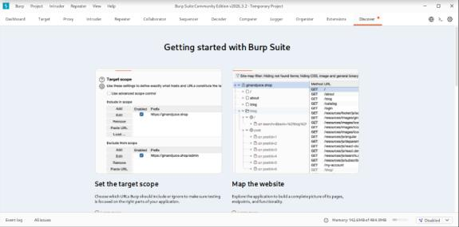 |
| **Proxy del propio navegador** (FoxyProxy) configurado hacia Burp | 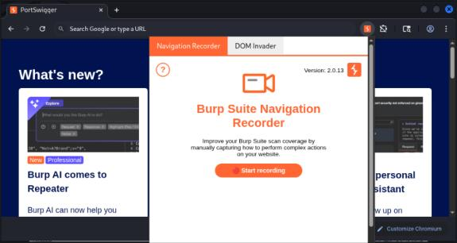 |
| **Docker instalado** — `docker --version` | 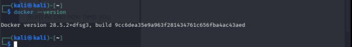 |
| **Scope** — contenedor de Juice Shop corriendo, health check OK | 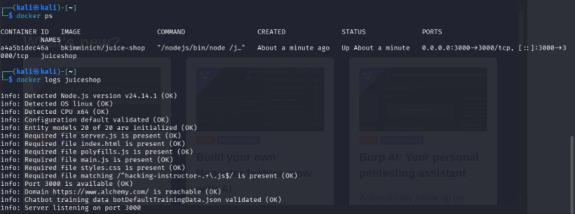 |

---

## 📊 Resumen de hallazgos

| Vulnerabilidad | Severidad | OWASP | Estado |
|---|---|---|---|
| Admin Panel – Broken Access Control | **Crítica** | A01 | ✅ Confirmado |
| SQL Injection – Login Bypass | **Crítica** | A02 | ✅ Confirmado |
| DOM XSS | **Crítica** | A05 | ✅ Confirmado |
| Bonus Payload (iframe injection) | **Crítica** | A05 | ✅ Confirmado |
| Admin Registration | Alta | A01 | ✅ Confirmado |
| IDOR – Acceso a Perfil de Otro Usuario | **Crítica** | A01 | ✅ Confirmado |
| Directory Listing — /ftp Expuesto | Media | A01 | ✅ Confirmado |
| Error Handling | Media | A02 | ✅ Confirmado |
| API Data Exposure — Enumerar Usuarios | Media | A01 | ✅ Confirmado |
| Broken Auth — Sin Rate Limiting en Login | Media | A07 | ✅ Confirmado |

---

## 🔍 Hallazgos detallados

### Write-up 1 — Admin Panel: Broken Access Control
**Severidad:** CWE-284: Improper Access Control

**Descripción:** El panel de administración es accesible sin autenticación ni validación de privilegios; cualquier usuario puede llegar a funcionalidades administrativas simplemente descubriendo la ruta `/admin`.

**Pasos a reproducir:**
1. Acceder a `http://localhost:3000`.
2. Revisar el Site Map o inspeccionar manualmente los recursos cargados.
3. Analizar `main.js` para identificar rutas ocultas.
4. Encontrar la referencia a `/admin`.
5. Navegar directamente a `http://localhost:3000/admin`.
6. Observar que el panel es accesible sin autenticación.
7. Verificar el banner de "Reto completado".

**Evidencias:**

| Árbol de site map. Buscando rutas ocultas (`main.js`) | Búsqueda de ruta hacia admin |
|---|---|
| 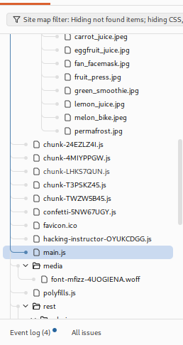 | 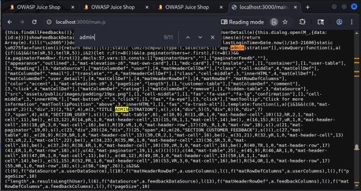 |

| Panel de administrador | Banner de reto completado |
|---|---|
| 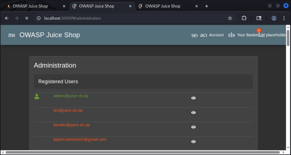 | 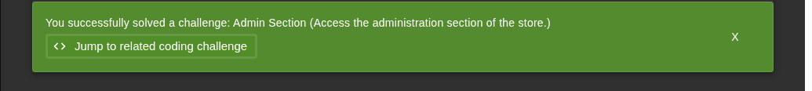 |

**Impacto real:** acceso no autorizado a funcionalidades administrativas, manipulación de datos sensibles, exposición de información interna, escalamiento de privilegios; en un entorno real podría significar el compromiso total del sistema.

**Remediación:** autenticación obligatoria en `/admin` y rutas sensibles; RBAC en el backend; no exponer rutas sensibles en JS público; middleware de validación de tokens/sesión; pruebas de seguridad periódicas.

**Referencia OWASP/CWE:** [A01:2025 Broken Access Control](https://owasp.org/Top10/2025/A01_2025-Broken_Access_Control/) · [CWE-284](https://cwe.mitre.org/data/definitions/284.html)

---

### Write-up 2 — SQL Injection: Login Bypass
**Severidad:** CWE-89 – Improper Neutralization of Special Elements used in an SQL Command

**Descripción:** El parámetro `email` del endpoint de login no valida ni sanitiza la entrada, permitiendo alterar la lógica SQL de autenticación y eludir el login.

**Pasos a reproducir:**
1. Acceder al login de Juice Shop.
2. Interceptar el tráfico con Burp Suite.
3. Intentar login con credenciales cualquiera (`test@test.com` / `test`).
4. Interceptar `POST /rest/user/login` y enviarlo a Repeater.
5. Modificar el campo `email` con un payload que altera la lógica SQL.
6. Enviar y observar que la respuesta contiene un token JWT (login bypasseado).
7. Usar el token para validar acceso con privilegios elevados.

**Evidencias:**

| Modificación de reglas de intercepción | Activar intercept |
|---|---|
| 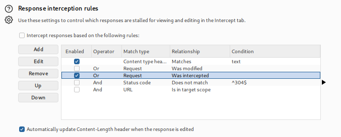 | 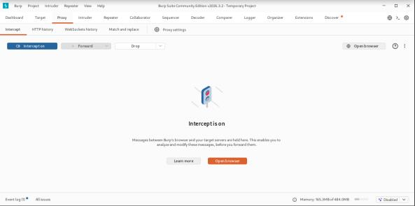 |

| Usuario realizando login | Post interceptado |
|---|---|
| 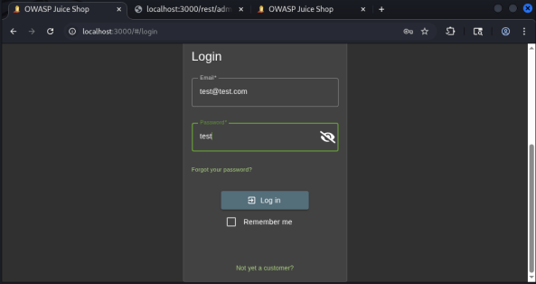 | 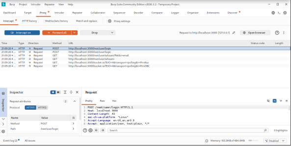 |

| Antes de modificar el payload | Payload modificado + respuesta con token |
|---|---|
| 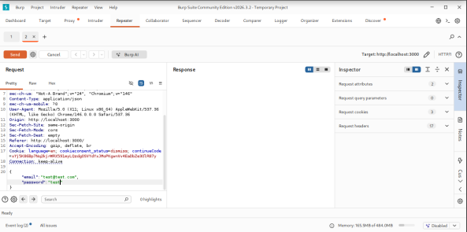 | 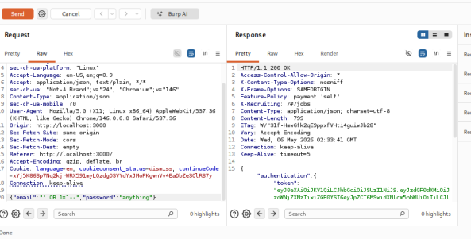 |

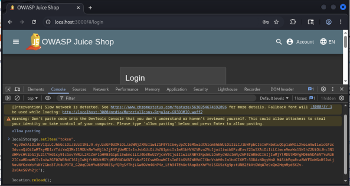

<em>Acceso a la aplicación utilizando el token obtenido.</em>

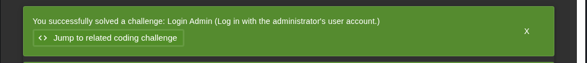

<em>"Login Admin" — reto completado.</em>

**Impacto real:** acceso no autorizado a cuentas (incluidas administrativas), exposición/modificación/eliminación de datos, compromiso total de la aplicación, escalada de privilegios y potencial pivoting.

**Remediación:** consultas parametrizadas (prepared statements); validación/sanitización estricta; evitar concatenar SQL; WAF, monitoreo de patrones anómalos y rate limiting; revisión de código; rotación de credenciales/tokens comprometidos.

**Referencia OWASP/CWE:** [A05:2025 Injection](https://owasp.org/Top10/2025/A05_2025-Injection/) · [CWE-89](https://cwe.mitre.org/data/definitions/89.html)

---

### Write-up 3 — DOM XSS
**Severidad:** CWE-79 – Improper Neutralization of Input During Web Page Generation

**Descripción:** El JavaScript del cliente procesa datos no confiables de la URL/DOM sin sanitización, permitiendo XSS basado en DOM.

**Pasos a reproducir:**
1. En la barra de búsqueda de Juice Shop, escribir: `<iframe src="javascript:alert('DOM_XSS')">`
2. Presionar Enter → se ejecuta el `alert`.
3. En Burp HTTP History, revisar `GET /rest/products/search?q=` con el payload en la URL.

**Evidencias:**

| Alerta ejecutándose en el navegador | URL con el payload |
|---|---|
| 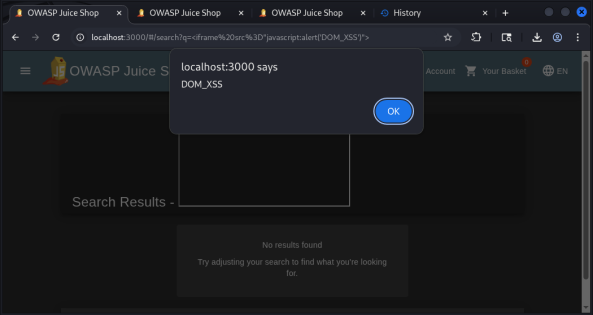 | 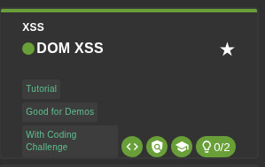 |

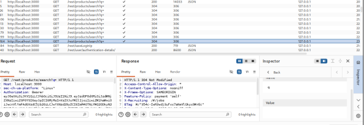

<em>Reto "DOM XSS" completado.</em>

**Impacto real:** ejecución arbitraria de JS, robo de tokens/cookies de sesión, suplantación de identidad, manipulación del contenido, redirecciones maliciosas, escalamiento a CSRF/phishing interno.

**Remediación:** evitar `innerHTML`/`document.write`/`eval`; usar `textContent`/`innerText`/`createElement`; sanitización estricta de datos de URL/DOM; CSP; revisión de sinks peligrosos.

**Referencia OWASP/CWE:** [A05:2025 Injection](https://owasp.org/Top10/2025/A05_2025-Injection/) · [CWE-79](https://cwe.mitre.org/data/definitions/79.html)

---

### Write-up 4 — Bonus Payload
**Severidad:** CWE-79 – Improper Neutralization of Input During Web Page Generation

**Descripción:** El sink vulnerable de DOM XSS permite además inyectar HTML arbitrario, incluyendo `<iframe>` de dominios externos (SoundCloud en la prueba).

**Pasos a reproducir:**
1. Identificar la funcionalidad vulnerable que refleja datos de URL/DOM sin sanitización.
2. Confirmar el sink inseguro (`innerHTML`).
3. Sustituir el valor por un payload HTML con `<iframe>`.
4. Recargar y observar que el iframe externo se renderiza dentro de la app.
5. Validar que el contenido proviene de un dominio externo.

**Evidencias:**

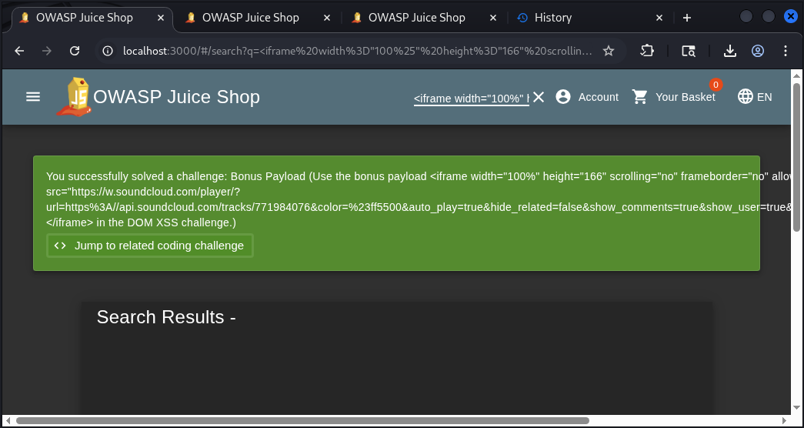

<em>Reto "Bonus Payload" completado — iframe de SoundCloud embebido dentro de Juice Shop.</em>

**Impacto real:** phishing visual dentro de la propia aplicación, formularios/interfaces falsas, manipulación del contenido mostrado, potencial ingeniería social, pérdida de confianza del usuario.

**Remediación:** evitar sinks inseguros; sanitización estricta (p. ej. DOMPurify); validar/codificar salida; CSP que bloquee iframes externos no autorizados; revisión de flujos de datos del cliente.

**Referencia OWASP/CWE:** [A05:2025 Injection](https://owasp.org/Top10/2025/A05_2025-Injection/) · [CWE-79](https://cwe.mitre.org/data/definitions/79.html)

---

### Write-up 5 — Admin Registration
**Severidad:** CWE-639 - Authorization Bypass Through User-Controlled Key

**Descripción:** La app confía en un parámetro de rol enviado por el cliente en el registro, sin validarlo en el servidor, permitiendo crear cuentas con privilegios de administrador.

**Pasos a reproducir:**
1. Acceder al registro de usuario.
2. Interceptar el tráfico con Burp Suite.
3. Completar el formulario y enviarlo.
4. Interceptar `POST /api/Users` y enviarlo a Repeater.
5. Modificar/agregar el parámetro de rol.
6. Enviar la solicitud modificada.
7. Confirmar registro exitoso con privilegios administrativos.

**Evidencias:**

| Payload modificado + respuesta del servidor | Banner de reto completado |
|---|---|
| 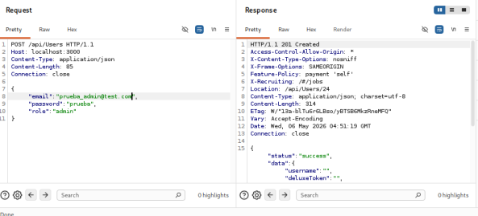 |  |

**Impacto real:** creación de cuentas administrativas no autorizadas, acceso a paneles de gestión, modificación/exfiltración de datos, compromiso total de integridad/disponibilidad.

**Remediación:** eliminar cualquier parámetro de rol enviado desde el cliente; asignar roles solo en el servidor; validaciones estrictas en backend; controles de autorización en todos los endpoints sensibles; monitoreo de manipulación de parámetros.

**Referencia OWASP/CWE:** [A01:2025 Broken Access Control](https://owasp.org/Top10/2025/A01_2025-Broken_Access_Control/) · [CWE-639](https://cwe.mitre.org/data/definitions/639.html)

---

### Write-up 6 — IDOR: Acceso a Perfil de Otro Usuario
**Severidad:** CWE-639 - Authorization Bypass Through User-Controlled Key

**Descripción:** Se puede acceder/manipular recursos internos modificando un identificador en la URL o cuerpo de la solicitud, sin controles de autorización.

**Pasos a reproducir:**
1. Iniciar sesión con un usuario legítimo.
2. Navegar a un recurso por ID (`/api/orders/101`).
3. Interceptar con Burp Suite → Repeater.
4. Modificar el ID (101 → 102, 103...).
5. Enviar la solicitud modificada.
6. Observar que el servidor devuelve datos de otro usuario.

**Evidencias:**

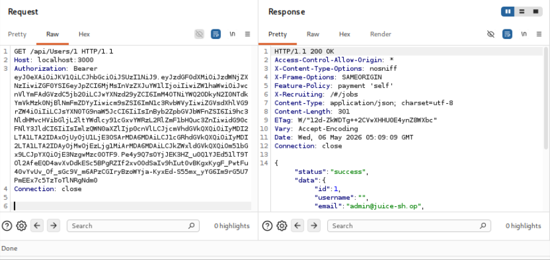

<em><code>GET /api/Users/1</code> devuelve datos del usuario <code>admin@juice-sh.op</code> sin validar que el solicitante sea ese usuario.</em>

**Impacto real:** acceso a información personal de otros usuarios, lectura/modificación de pedidos/perfiles, escalada horizontal y vertical, exposición masiva de datos, riesgo de cumplimiento (GDPR/PCI/HIPAA).

**Remediación:** controles de autorización por recurso en el servidor; validar permiso del usuario autenticado; usar UUIDs no predecibles; RBAC/ABAC; monitoreo de accesos sospechosos; pruebas periódicas de Broken Access Control.

**Referencia OWASP/CWE:** [A01:2025 Broken Access Control](https://owasp.org/Top10/2025/A01_2025-Broken_Access_Control/) · [CWE-639](https://cwe.mitre.org/data/definitions/639.html)

---

### Write-up 7 — Directory Listing: /ftp Expuesto
**Severidad:** CWE-548 – Exposure of Information Through Directory Listing

**Descripción:** El directorio `/ftp` está expuesto públicamente y permite listar su contenido sin autenticación (directory listing habilitado).

**Pasos a reproducir:**
1. Acceder a `/ftp` desde el navegador.
2. Observar el listado completo del directorio.
3. Confirmar que no se requiere autenticación.
4. Navegar entre subdirectorios y archivos.
5. Descargar archivos para confirmar el acceso total.
6. Verificar contenido sensible.

**Evidencias:**

| Acceso al endpoint público /ftp | Árbol de site map — carpeta /ftp expandida |
|---|---|
| 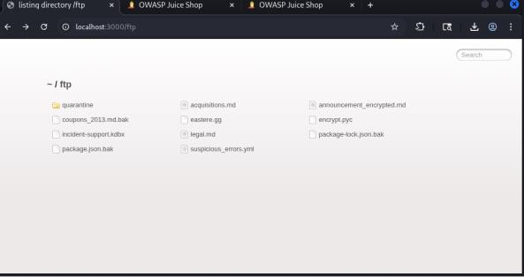 | 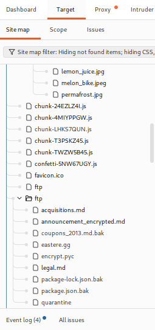 |

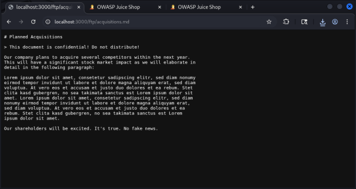

<em>Archivo con información confidencial encontrado dentro de <code>/ftp</code>.</em>

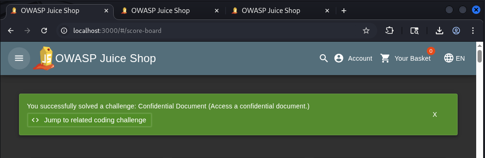

<em>Reto "Confidential Document" completado.</em>

**Impacto real:** acceso a archivos sensibles (logs, backups, configuraciones), filtración de credenciales/tokens/API keys, reconocimiento de la estructura interna, preparación de ataques más avanzados (LFI, RFI, path traversal, brute force).

**Remediación:** deshabilitar directory listing (Apache/Nginx/IIS); restringir acceso por autenticación o firewall; mover archivos sensibles fuera de rutas públicas; limpiar archivos innecesarios; least privilege; permisos correctos; análisis de impacto real.

**Referencia OWASP/CWE:** [A01:2025 Broken Access Control](https://owasp.org/Top10/2025/A01_2025-Broken_Access_Control/) · [CWE-548](https://cwe.mitre.org/data/definitions/548.html)

---

### Write-up 8 — Error Handling
**Severidad:** CWE-209: Generation of Error Message Containing Sensitive Information

**Descripción:** El servidor responde con un HTTP 500 que incluye el stack trace completo ante datos malformados (JSON incompleto/parámetros undefined).

**Pasos a reproducir:**
1. Interceptar una petición a `/api/Feedbacks` con Burp.
2. Enviarla a Repeater.
3. Modificar el JSON para que sea sintácticamente incorrecto.
4. Enviar y observar la respuesta HTML/texto con el stack trace.

**Evidencias:**

| Respuesta de error con info técnica expuesta | Banner de reto completado |
|---|---|
| 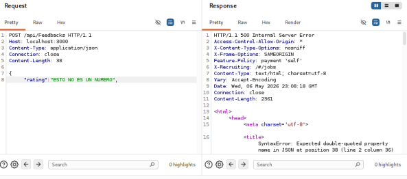 |  |

**Impacto real:** revela información crítica de infraestructura (rutas absolutas, versiones de librerías, lógica interna del backend), facilitando el reconocimiento del atacante.

**Remediación:** no mostrar errores detallados en producción; manejador de errores global con mensajes genéricos.

**Referencia OWASP/CWE:** [A02:2025 Security Misconfiguration](https://owasp.org/Top10/2025/A02_2025-Security_Misconfiguration/) · [CWE-209](https://cwe.mitre.org/data/definitions/209.html)

---

### Write-up 9 — API Data Exposure: Enumerar Usuarios
**Severidad:** CWE-213: Exposure of Sensitive Information Due to Incompatible Policies

**Descripción:** El endpoint `/api/Users` permite a cualquier usuario autenticado listar todos los registros de la base de datos de usuarios, sin filtros de autorización por rol.

**Pasos a reproducir:**
1. Iniciar sesión con un usuario común y obtener su JWT.
2. En Repeater, hacer `GET /api/Users`.
3. Incluir `Authorization: Bearer [token]`.
4. Analizar el JSON con la lista completa de usuarios.

**Evidencias:**

| Repeater — request | Response — lista completa de usuarios |
|---|---|
| 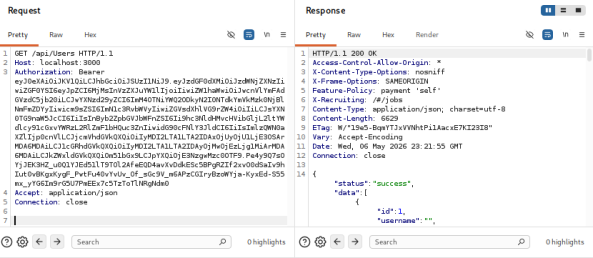 | 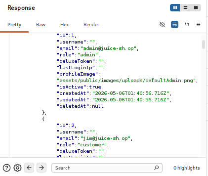 |

**Impacto real:** fuga de PII — correos, roles, IPs del último login y tokens especiales de todos los usuarios, facilitando phishing o escalada de privilegios.

**Remediación:** controles de acceso a nivel de objeto (BOLA); el endpoint solo debe devolver el perfil del solicitante o restringirse a roles administrativos.

**Referencia OWASP/CWE:** [A01:2025 Broken Access Control](https://owasp.org/Top10/2025/A01_2025-Broken_Access_Control/) · [CWE-213](https://cwe.mitre.org/data/definitions/213.html)

---

### Write-up 10 — Broken Auth: Sin Rate Limiting en Login
**Severidad:** CWE-307: Improper Restriction of Excessive Authentication Attempts

**Descripción:** El login procesa intentos ilimitados sin bloquear cuenta ni IP, permitiendo fuerza bruta automatizada.

**Pasos a reproducir:**
1. Capturar un login fallido (`POST /rest/user/login`) y enviarlo a Intruder.
2. Configurar la posición de payload en `password`.
3. Cargar un diccionario de contraseñas comunes.
4. Iniciar el ataque y observar respuestas 401 sin bloqueos ni retardos.

**Evidencias:**

| Request a interceptar | Request a Intruder |
|---|---|
| 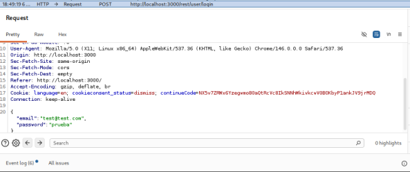 | 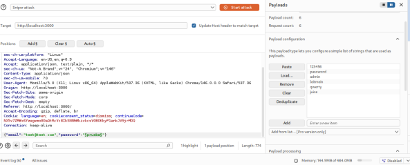 |

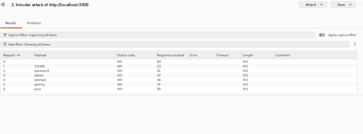

<em>Múltiples intentos ejecutados sin bloqueo (todas las respuestas HTTP 401, misma longitud/tiempo).</em>

**Impacto real:** compromiso de cuentas por diccionario o credential stuffing; la seguridad depende únicamente de la complejidad de la contraseña.

**Remediación:** bloqueo de cuenta tras N intentos fallidos; retardos progresivos (throttling); CAPTCHA ante actividad sospechosa.

**Referencia OWASP/CWE:** [A07:2025 Authentication Failures](https://owasp.org/Top10/2025/A07_2025-Authentication_Failures/) · [CWE-307](https://cwe.mitre.org/data/definitions/307.html)

---

## ✅ Conclusiones y recomendaciones

Entre las vulnerabilidades más preocupantes destacan una **inyección SQL** en el mecanismo de autenticación (permite eludir el login o acceder directamente a información sensible) y un **control de acceso deficiente en el panel de administración** (permite a usuarios no autorizados ejecutar acciones reservadas para administradores). Estas fallas, por su impacto potencial, requieren atención inmediata y la implementación de medidas de mitigación prioritarias.

**Prioridades de remediación radican en severidad crítica.**
