# Guía de Laboratorio: Montaje de un Servidor OpenVPN

**Criptografía · Guía de Laboratorio**

Universidad Tecnológica de Panamá · Facultad de Ingeniería de Sistemas Computacionales


## 📌 Objetivo

Montar un servidor **OpenVPN** sobre Ubuntu Server, generando su propia infraestructura de llaves (PKI) con **EasyRSA**, configurando el servicio, emitiendo un certificado de cliente y validando la conexión VPN de extremo a extremo.

---

## 🖥️ 1. Preparación del servidor

### Acceso root / privilegios

```bash
sudo whoami
# root
```

<p align="center">
  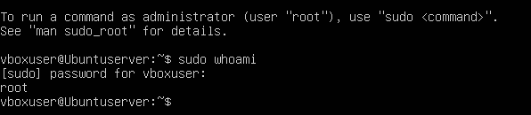
</p>

### Actualización de paquetes

```bash
sudo apt update && sudo apt upgrade -y
```

<p align="center">
  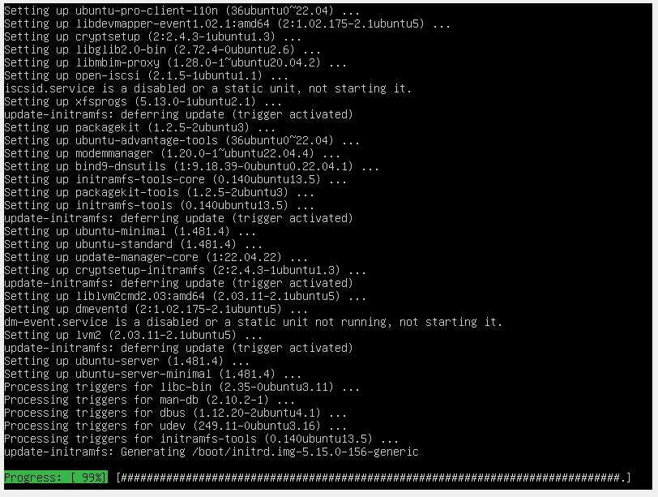
</p>
<p align="center"><em>Actualización en progreso...</em></p>

<p align="center">
  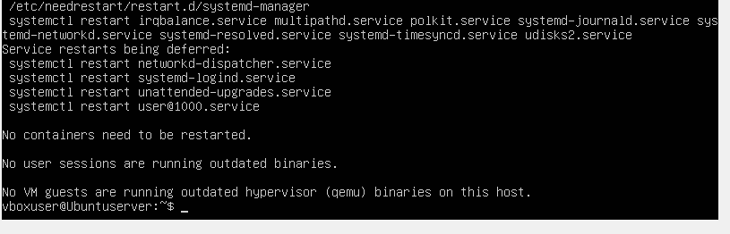
</p>
<p align="center"><em>Paquetes actualizados, sin servicios pendientes de reinicio crítico.</em></p>

---

## 📦 2. Instalación de OpenVPN y Easy-RSA

```bash
sudo apt install openvpn easy-rsa -y
```

<p align="center">
  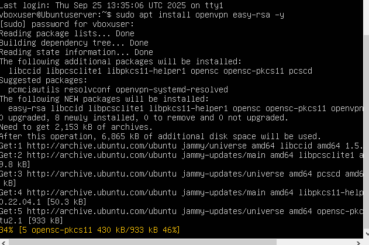
</p>

<p align="center">
  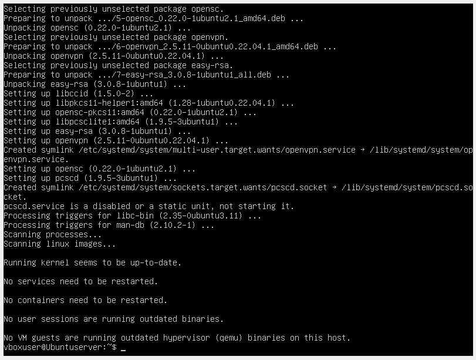
</p>
<p align="center"><em>Paquetes <code>openvpn</code>, <code>easy-rsa</code> y dependencias instalados correctamente.</em></p>

---

## 🔐 3. Creación de la infraestructura de llaves (PKI) con EasyRSA

### Directorio de trabajo

```bash
make-cadir ~/openvpn-ca
cd ~/openvpn-ca
```

<p align="center">
  
</p>

### Inicializar PKI

```bash
sudo ./easyrsa init-pki
```

<p align="center">
  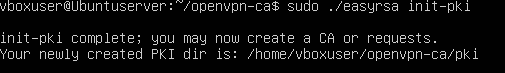
</p>

### Construir la Autoridad Certificadora (CA)

```bash
sudo ./easyrsa build-ca
```

Common Name usado: `openvpn-ca`

<p align="center">
  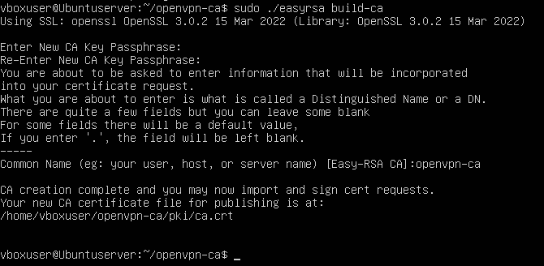
</p>

### Certificado del servidor

```bash
sudo ./easyrsa sign-req server server
```

<p align="center">
  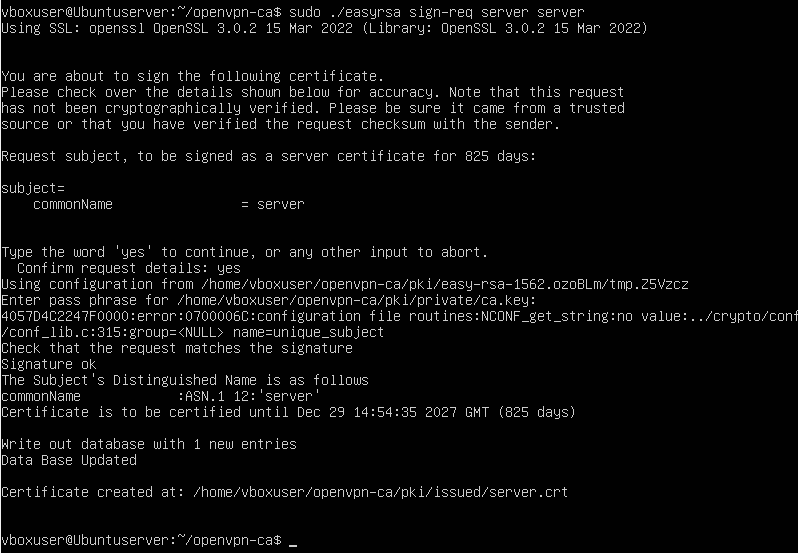
</p>
<p align="center"><em>Certificado del servidor firmado y válido por 825 días.</em></p>

### Parámetros Diffie-Hellman

```bash
sudo ./easyrsa gen-dh
```

<p align="center">
  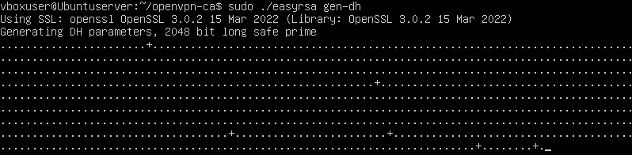
</p>
<p align="center"></p>
<p align="center"><em>Parámetros DH de 2048 bits generados en <code>pki/dh.pem</code>.</em></p>

### Clave HMAC (ta.key) — capa adicional de seguridad

```bash
openvpn --genkey secret ta.key
```

<p align="center">
  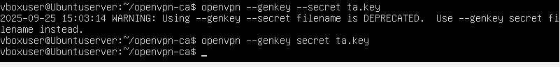
</p>

### Copiar archivos necesarios a /etc/openvpn/

```bash
sudo cp pki/ca.crt pki/issued/server.crt pki/private/server.key pki/dh.pem ta.key /etc/openvpn/
```

<p align="center">
  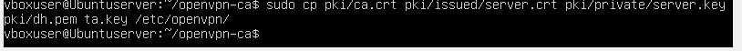
</p>

### Verificación de archivos

```bash
ls -l /etc/openvpn/
```

<p align="center">
  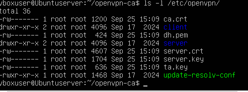
</p>
<p align="center"><em><code>ca.crt</code>, <code>dh.pem</code>, <code>server.crt</code>, <code>server.key</code>, <code>ta.key</code> presentes.</em></p>

---

## ⚙️ 4. Configuración del servidor OpenVPN

### Archivo `/etc/openvpn/server.conf`

<p align="center">
  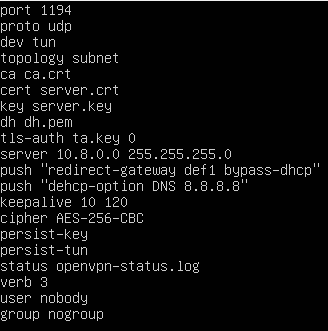
</p>

```
port 1194
proto udp
dev tun
topology subnet
ca ca.crt
cert server.crt
key server.key
dh dh.pem
tls-auth ta.key 0
server 10.8.0.0 255.255.255.0
push "redirect-gateway def1 bypass-dhcp"
push "dhcp-option DNS 8.8.8.8"
keepalive 10 120
cipher AES-256-CBC
persist-key
persist-tun
status openvpn-status.log
verb 3
user nobody
group nogroup
```

### Habilitar reenvío de IP (IP forwarding)

Se descomenta `net.ipv4.ip_forward=1` en `/etc/sysctl.conf`:

<p align="center">
  
</p>

```bash
sudo sysctl -p
```

<p align="center">
  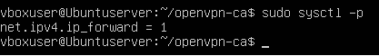
</p>

### Iniciar y habilitar el servicio

```bash
sudo systemctl start openvpn@server
sudo systemctl enable openvpn@server
```

<p align="center">
  
</p>
<p align="center">
  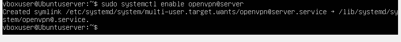
</p>

### Verificar estado del servicio

```bash
sudo systemctl status openvpn@server.service
```

<p align="center">
  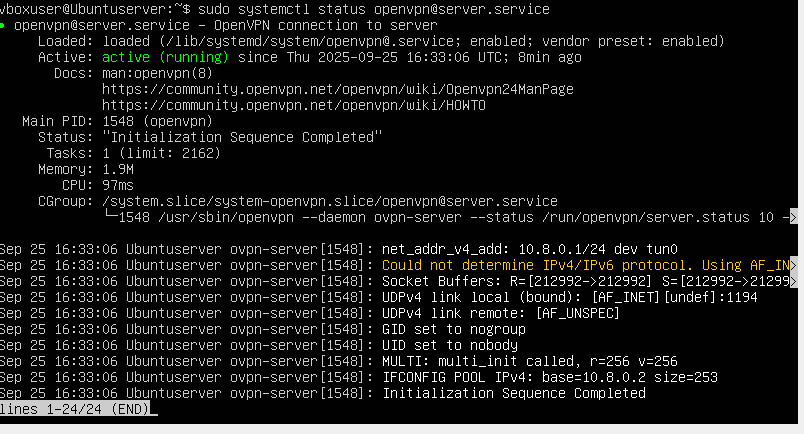
</p>
<p align="center"><em>Servicio <strong>active (running)</strong>: túnel <code>tun0</code> con IP 10.8.0.1, "Initialization Sequence Completed".</em></p>

---

## 👤 5. Certificado de cliente

### Generar solicitud de certificado (sin passphrase)

```bash
sudo ./easyrsa gen-req client1 nopass
```

<p align="center">
  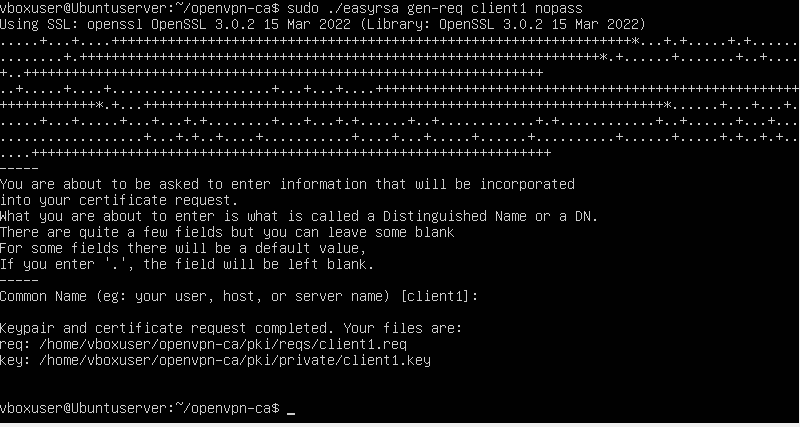
</p>

### Firmar el certificado del cliente

```bash
sudo ./easyrsa sign-req client client1
```

<p align="center">
  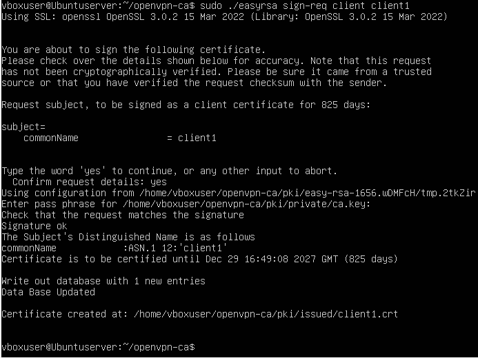
</p>

### Copiar archivos al cliente

```bash
mkdir client-files
sudo cp /etc/openvpn/ca.crt client-files/
sudo cp /etc/openvpn/ta.key client-files/
sudo cp openvpn-ca/pki/issued/client1.crt client-files/
sudo cp openvpn-ca/pki/private/client1.key client-files/
```

<p align="center">
  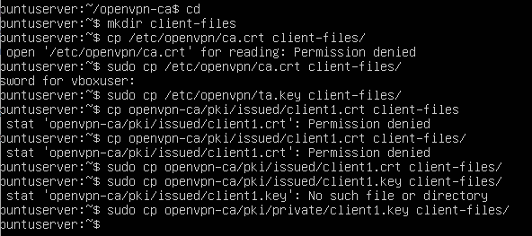
</p>

---

## 📄 6. Archivo de configuración del cliente (`client1.ovpn`)

<p align="center">
  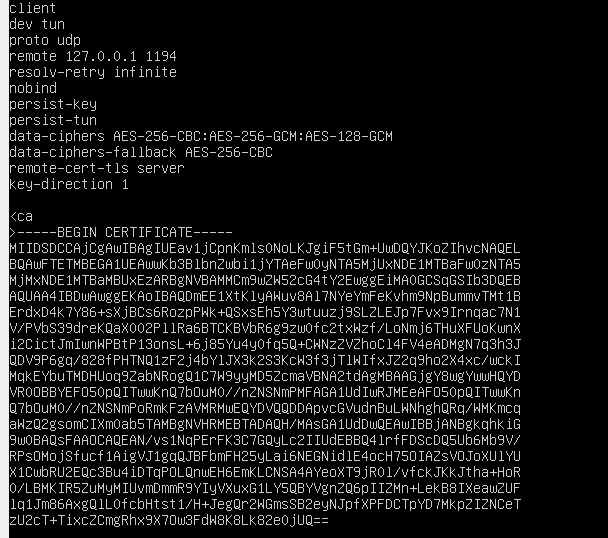
</p>

```
client
dev tun
proto udp
remote 127.0.0.1 1194
resolv-retry infinite
nobind
persist-key
persist-tun
data-ciphers AES-256-CBC:AES-256-GCM:AES-128-GCM
data-ciphers-fallback AES-256-CBC
remote-cert-tls server
key-direction 1
<ca> ... </ca>
<cert> ... </cert>
<key> ... </key>
<tls-auth> ... </tls-auth>
```

> 📝 **Nota del laboratorio:** *"Le tuve que cambiar la parte del cipher porque me decía que era obsoleto."* — Se reemplazó el cifrador simple (`cipher AES-256-CBC`) por `data-ciphers` con fallback, ya que los clientes OpenVPN recientes marcan `cipher` como una directiva en desuso.

---

## ✅ 7. Prueba de conexión

### Cliente OpenVPN GUI (Windows)

<p align="center">
  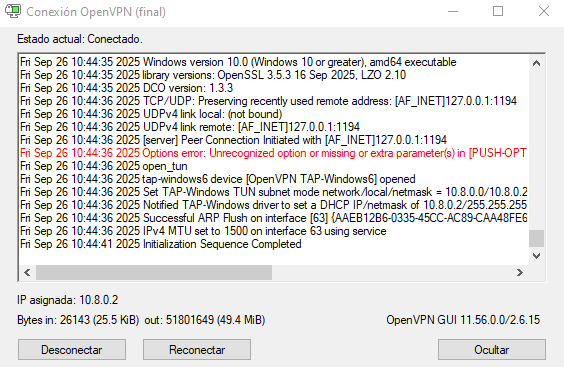
</p>
<p align="center"><em>Estado: <strong>Conectado</strong> · IP asignada: <code>10.8.0.2</code>.</em></p>

### Verificación desde el servidor (máquina host)

<p align="center">
  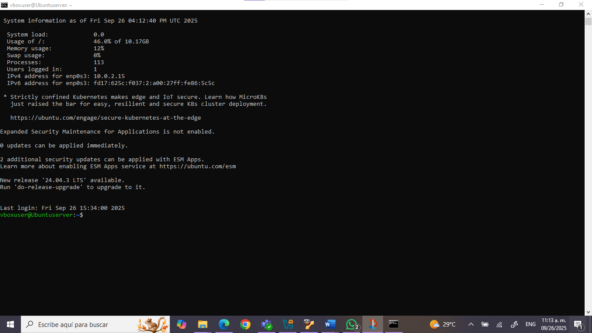
</p>

### Prueba de conectividad (ping por el túnel)

```bash
ping 10.8.0.1
```

<p align="center">
  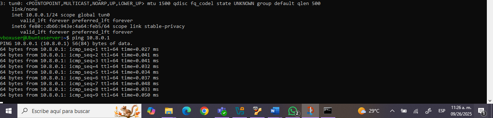
</p>
<p align="center"><em>Interfaz <code>tun0</code> activa (10.8.0.1/24) — respuesta ICMP exitosa en ~0.03–0.05 ms.</em></p>

### Prueba en un puerto alternativo (5000)

<p align="center">
  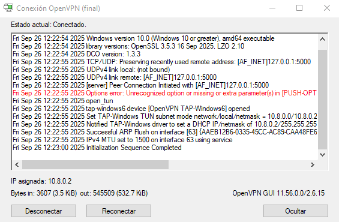
</p>
<p align="center"><em>Conexión exitosa reconfigurando el servidor/cliente al puerto <code>5000</code>, IP asignada nuevamente <code>10.8.0.2</code>.</em></p>

---

## 🧩 Resumen del flujo

```
Ubuntu Server (root)
   ↓ apt install openvpn easy-rsa
   ↓ easyrsa: init-pki → build-ca → sign-req server → gen-dh → genkey ta.key
   ↓ cp certs/keys → /etc/openvpn/
   ↓ server.conf (puerto 1194/UDP, subred 10.8.0.0/24, AES-256)
   ↓ ip_forward=1 + systemctl start/enable openvpn@server
   ↓ easyrsa: gen-req client1 → sign-req client client1
   ↓ client1.ovpn (certs embebidos, cipher actualizado)
   ↓ Conexión desde OpenVPN GUI → IP 10.8.0.2 asignada, ping OK
```

```
