# 🔒 Hardening y Auditoría de Seguridad SSH

Laboratorio de ciberseguridad ofensiva/defensiva: se endureció un servidor SSH (Ubuntu Server) siguiendo buenas prácticas de la industria y luego se validó esa configuración lanzando ataques de fuerza bruta controlados desde una máquina Kali Linux, comparando el comportamiento del servidor **antes** y **después** del hardening.

> Proyecto realizado como parte de la Licenciatura en Ciberseguridad, asignatura *Gestión de Almacenamiento de Información* (Laboratorio No. 5). Todo el trabajo se ejecutó en un laboratorio virtual aislado (red NAT privada), sin tocar sistemas de terceros.

---

## 🎯 Objetivo

Demostrar, de forma práctica y medible, cómo un conjunto de controles de hardening en `sshd_config` + Fail2Ban convierte un servidor SSH vulnerable a fuerza bruta en un objetivo prácticamente inmune a ese vector de ataque, y documentar la evidencia en logs.

## 🗺️ Topología del laboratorio

Red privada NAT `192.168.159.0/24`, topología estrella/bus virtual.

| Nodo | Sistema Operativo | IP | Función |
|---|---|---|---|
| Atacante | Kali Linux | `192.168.159.134` | Origen de escaneos (`nc`) y fuerza bruta (`hydra`, `medusa`) |
| Víctima | Ubuntu Server | `192.168.159.139` | Host endurecido: SSH + llaves Ed25519 + Fail2Ban |
| Canal | Virtual Switch | N/A | Interfaz virtual (VMware/VirtualBox) entre nodos |

---

## 🛡️ Fase 1 — Hardening del servidor SSH

**Instalación y verificación de OpenSSH Server**

Se instaló el paquete durante el setup de Ubuntu Server y se confirmó que el servicio estaba activo con `systemctl status ssh`.

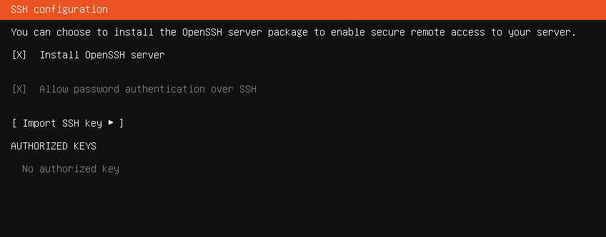
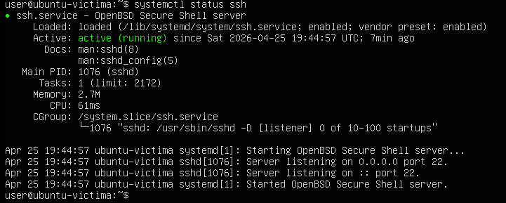

**Directivas de seguridad aplicadas en `/etc/ssh/sshd_config`**

Antes de editar se generó un respaldo (`sshd_config.bak`). Las directivas clave endurecidas:

| Directiva | Valor | Propósito |
|---|---|---|
| `Port` | `2222` | Reduce escaneos automatizados al puerto estándar 22 |
| `PermitRootLogin` | `no` | Elimina el login directo como root |
| `MaxAuthTries` | `3` | Limita intentos de autenticación por conexión |
| `PubkeyAuthentication` | `yes` | Habilita autenticación por llave pública |
| `PasswordAuthentication` | `no` | Desactiva por completo el login por contraseña |
| `ClientAliveInterval` / `ClientAliveCountMax` | `300` / `0` | Cierra sesiones inactivas |
| `Banner` | `/etc/ssh/banner.txt` | Aviso legal antes de autenticar |
| `AllowUsers` | `user` | Restringe qué usuarios pueden conectarse por SSH |

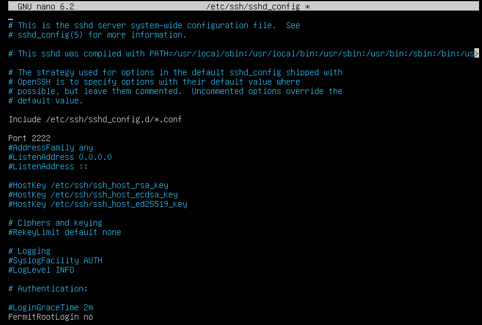
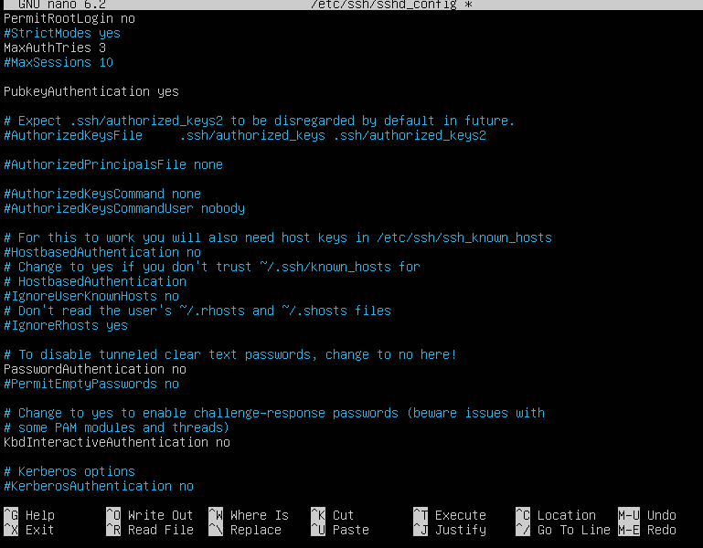
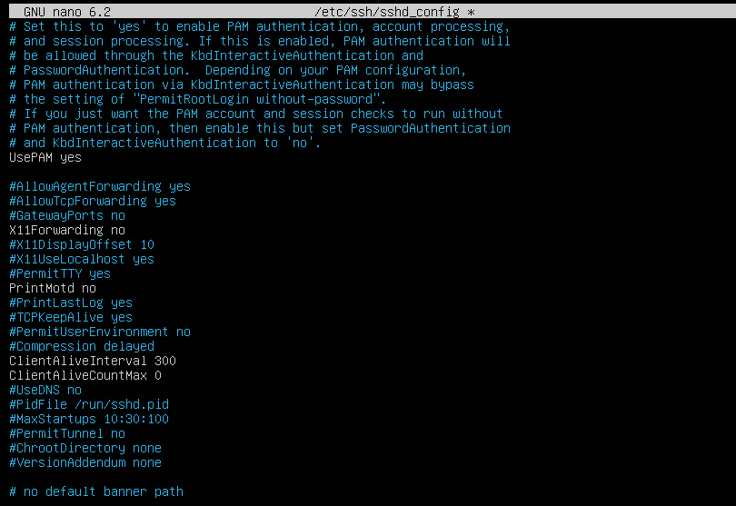
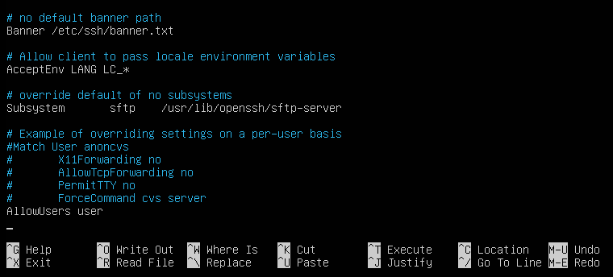

**Autenticación por llave pública (Ed25519)**

Se generó un par de llaves Ed25519 en el atacante/cliente (`ssh-keygen -t ed25519`) y se copió la llave pública al servidor con `ssh-copy-id` sobre el puerto 2222.

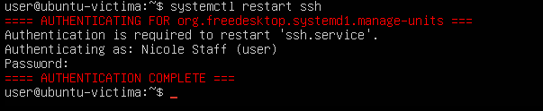
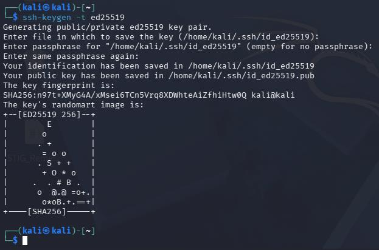
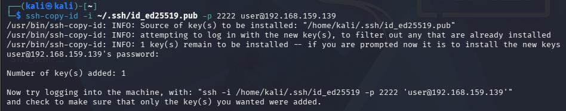
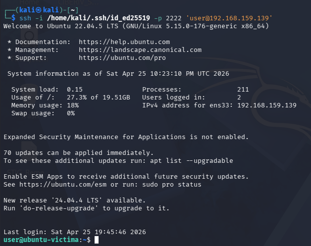

**Fail2Ban** — bloqueo automático de IPs con comportamiento de fuerza bruta:

```
[sshd]
enable   = true
port     = ssh
maxretry = 3
bantime  = 3600
findtime = 600
```

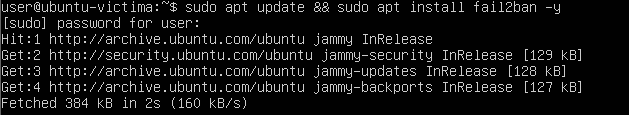
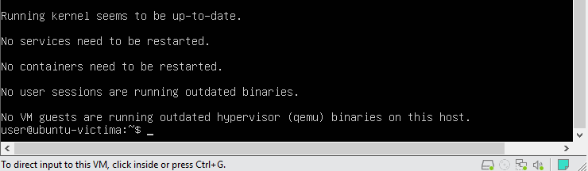

**Banner legal de advertencia** (`/etc/ssh/banner.txt`), mostrado antes de cualquier intento de autenticación:

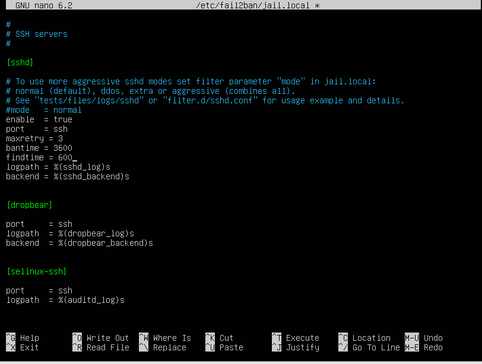
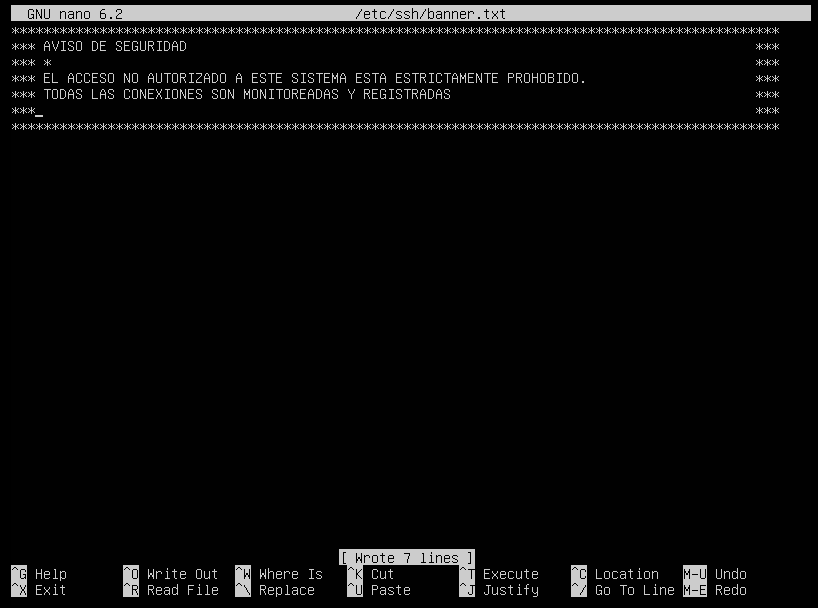

---

## ⚔️ Fase 2 — Ataque controlado (antes vs. después)

### Antes del hardening (puerto 22, autenticación por contraseña)

Se ejecutó **Hydra** contra el servidor. Dado que `rockyou.txt` completo tomaba demasiado tiempo, se usó un diccionario reducido con contraseñas típicas para validar el ataque de forma eficiente, y se corroboró el resultado con **Medusa**.

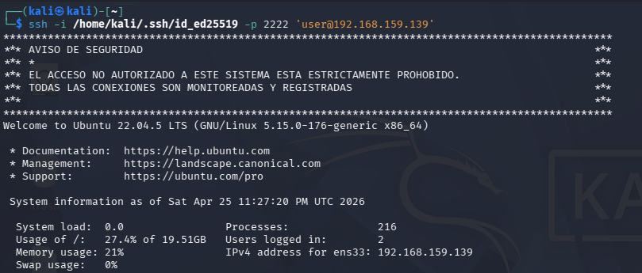
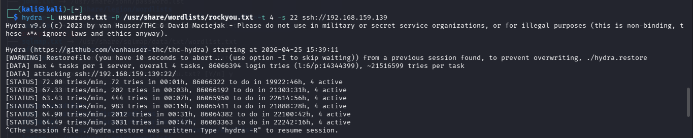
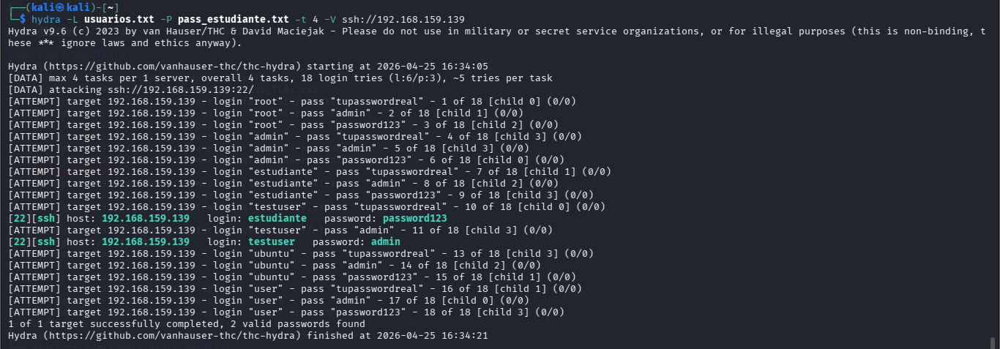

Monitoreo del ataque en tiempo real sobre `/var/log/auth.log`:

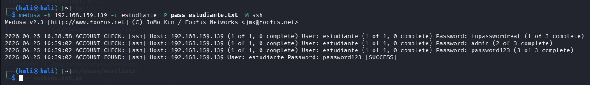
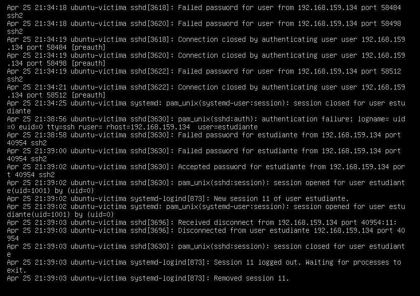

**Resultado:** el servidor aceptó una contraseña válida tras una serie de intentos fallidos — el ataque de diccionario tuvo éxito.

### Después del hardening (puerto 2222, solo llave pública, Fail2Ban activo)

Se repitió exactamente el mismo ataque Hydra contra el servidor ya endurecido.

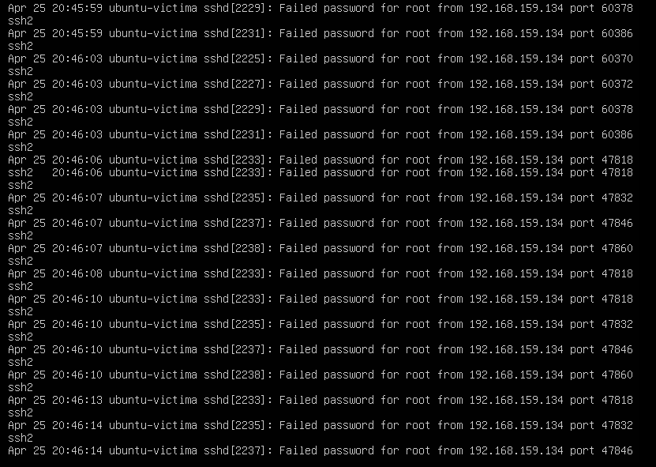
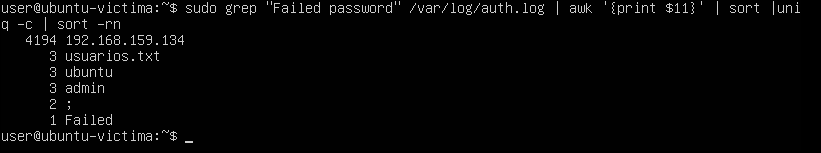

**Resultado:** `0 valid passwords found`. El servidor rechaza cualquier intento porque `PasswordAuthentication` está deshabilitado, y Fail2Ban banea la IP del atacante automáticamente tras superar `maxretry`.

---

## 📊 Análisis comparativo

| Característica | Servidor vulnerable | Servidor endurecido |
|---|---|---|
| Superficie de ataque | Puerto estándar 22 (fácil de escanear) | Puerto no estándar 2222 |
| Método de entrada | Contraseñas (vulnerables a diccionario) | Llaves Ed25519 (inmunes a fuerza bruta) |
| Resiliencia | Nula; intentos ilimitados | Alta; baneo automático tras 3 intentos |
| Privilegios | Login directo como root posible | Root deshabilitado; usuario específico requerido |

**Diferencia clave en los logs:** en el escenario vulnerable, `auth.log` muestra una secuencia de `Failed password` seguida de un `Accepted password` — el servidor procesa cada intento sin resistencia. En el escenario endurecido, los logs muestran fallos de negociación de protocolo (no hay método de contraseña que probar), y `fail2ban.log` registra la detección y el baneo automático de la IP atacante, confirmado a nivel de red por `iptables`.

---

## ✅ Conclusiones

- **La medida más efectiva fue desactivar `PasswordAuthentication`.** Sin una contraseña que atacar, herramientas como Hydra o Medusa pierden toda utilidad, sin importar el tamaño del diccionario.
- **La seguridad es por capas, no por una sola herramienta:** cambiar el puerto reduce ruido, las llaves eliminan el vector de contraseña, y Fail2Ban castiga activamente cualquier intento residual.
- **Los logs son la "caja negra" del sistema:** sin `auth.log` y el log de Fail2Ban no habría forma de auditar ni demostrar qué ocurrió durante el incidente simulado.

## 🚀 Recomendaciones adicionales

- **Port Knocking** — mantener el puerto SSH cerrado hasta recibir una secuencia válida de "golpes".
- **2FA (Google Authenticator / Duo vía PAM)** — capa extra incluso si la llave privada se ve comprometida.
- **Auditoría con Lynis** — escaneos automáticos de hardening del kernel y permisos de archivos.
- **VPN de administración** — no exponer SSH directamente a Internet; requerir VPN previa para alcanzar el servidor.

---

## 🧰 Herramientas utilizadas

`OpenSSH` · `Fail2Ban` · `ssh-keygen` (Ed25519) · `Hydra` · `Medusa` · `nc` · `iptables` · `Kali Linux` · `Ubuntu Server`

## 📁 Estructura del repositorio

```
.
├── README.md
├── screenshots/          # Evidencia visual del laboratorio
└── extracted-text.md     # Texto crudo extraído del informe original (referencia)
```

---

## ⚖️ Nota ética

Todos los ataques se realizaron en un entorno de laboratorio propio, completamente aislado (red NAT privada), contra una máquina virtual creada específicamente para este ejercicio académico. Ningún sistema de terceros fue escaneado ni atacado. Este proyecto tiene fines exclusivamente educativos y de práctica defensiva.
