# Laboratorio Cloudflare — WAF (Web Application Firewall)

**Protección de una aplicación web mediante Cloudflare: DNS, Tunnel, SSL/TLS y reglas WAF personalizadas**

Universidad Tecnológica de Panamá · Facultad de Ingeniería en Sistemas Computacionales
Departamento de Arquitectura y Redes de Computadoras · Licenciatura en Ciberseguridad
Asignatura: **Ciberseguridad IV**
---

## 📌 Introducción

En el contexto actual de ciberseguridad, las aplicaciones web son uno de los principales objetivos de ataque. Este laboratorio documenta la protección de una aplicación mediante un **Web Application Firewall (WAF)** ofrecido por **Cloudflare**, cubriendo desde la compra del dominio hasta pruebas reales de bloqueo de ataques.

**Dominio usado:** [`nicocypher.me`](https://nicocypher.me)

---

## 🌐 1. Compra del dominio

Se registró el dominio `nicocypher.me` en Namecheap.

<p align="center">
  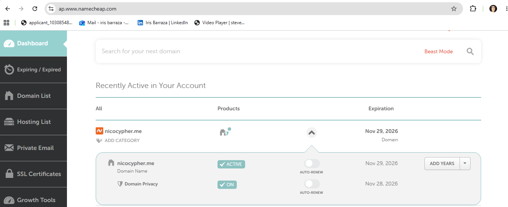
</p>
<p align="center"><em>Dashboard de Namecheap — dominio <code>nicocypher.me</code> activo.</em></p>

---

## 🔌 2. Configurar Cloudflare — Tunnel

La configuración previa de Cloudflare apuntaba a un servidor en AWS, pero al vencer el periodo de prueba se optó por crear un **túnel** hacia un Ubuntu Server local (de laboratorios anteriores).

**Pasos:**
1. Desde el panel de Cloudflare (**Zero Trust → Networks → Tunnels**) se crea el túnel.
2. Se copia el comando generado y se pega en la terminal del Ubuntu Server (vía PuTTY).

<table>
<tr>
<td width="50%">
<p align="center">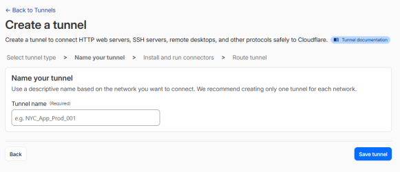</p>
<p align="center"><em>Creación del túnel en Zero Trust.</em></p>
</td>
<td width="50%">
<p align="center">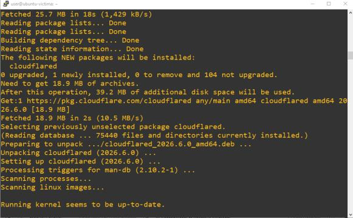</p>
<p align="center"><em>Instalación de <code>cloudflared</code> en el servidor Ubuntu.</em></p>
</td>
</tr>
</table>

### Conector activo y enrutamiento del servicio

Una vez instalado, el conector queda disponible y en línea. Para que Cloudflare sepa a dónde redirigir el tráfico, se completa el campo **Service** con la URL local (`localhost:80`) antes de guardar.

<table>
<tr>
<td width="50%">
<p align="center">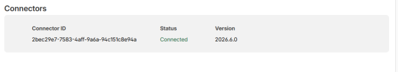</p>
<p align="center"><em>Connector <strong>Connected</strong>.</em></p>
</td>
<td width="50%">
<p align="center">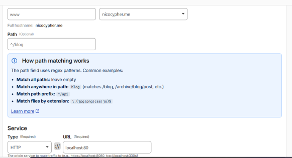</p>
<p align="center"><em>Configuración de <code>Service</code> (HTTP → localhost:80).</em></p>
</td>
</tr>
</table>

<p align="center">
  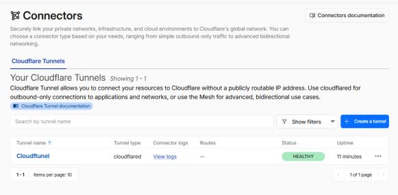
</p>
<p align="center"><em>Túnel <code>cloudflared</code> en estado <strong>HEALTHY</strong>.</em></p>

---

## 🗂️ 3. Registros DNS y SSL/TLS

Se verifican los registros DNS (proxied) del dominio, y se confirma el cifrado **SSL/TLS** activo entre el navegador, Cloudflare y el servidor origen.

<p align="center">
  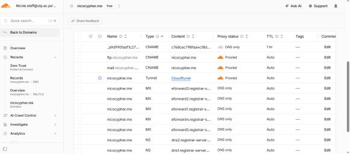
</p>
<p align="center"><em>Registros DNS del dominio, todos con proxy de Cloudflare activo.</em></p>

<table>
<tr>
<td width="50%">
<p align="center">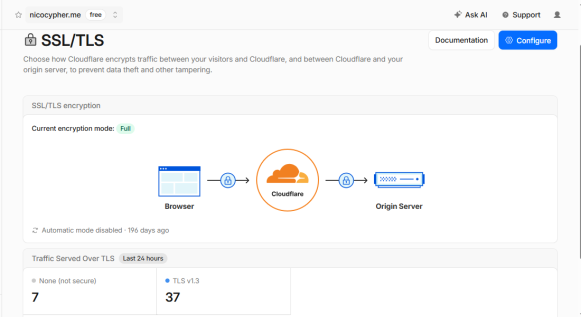</p>
<p align="center"><em>Modo de cifrado <strong>Full</strong>.</em></p>
</td>
<td width="50%">
<p align="center">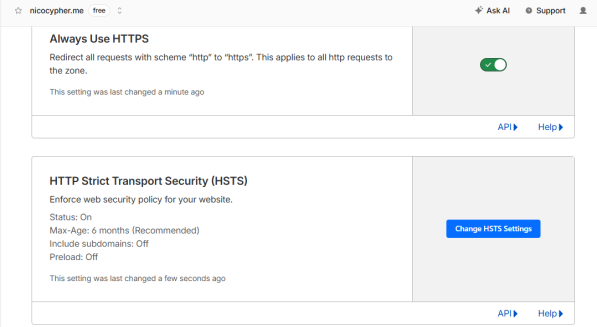</p>
<p align="center"><em><strong>Always Use HTTPS</strong> + HSTS habilitados.</em></p>
</td>
</tr>
</table>

**Prueba de resolución DNS:** al ingresar a `https://nicocypher.me`, el sitio responde correctamente (página por defecto de Apache2 en Ubuntu), confirmando que el túnel y el DNS funcionan de extremo a extremo.

<p align="center">
  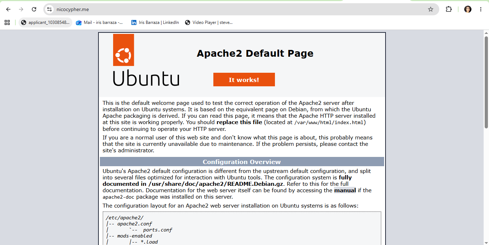
</p>
<p align="center"><em>El dominio resuelve correctamente hacia el Apache2 del servidor Ubuntu.</em></p>

---

## 🛡️ 4. Configurar el WAF — Capa a capa

El plan **Free** de Cloudflare para el dominio permite añadir hasta **5 reglas WAF personalizadas**.

<p align="center">
  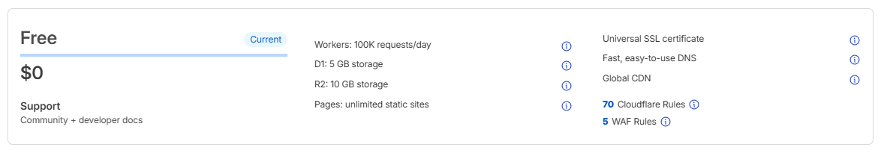
</p>
<p align="center"><em>Plan Free: 5 WAF Rules, 70 Cloudflare Rules, Universal SSL, CDN global.</em></p>

### Capa 1 — Cloudflare Managed Ruleset

Conjunto de reglas mantenido por Cloudflare que cubre **OWASP Top 10**, exploits conocidos y bots maliciosos. Se activa en un clic y **siempre debe estar ON**.

<p align="center">
  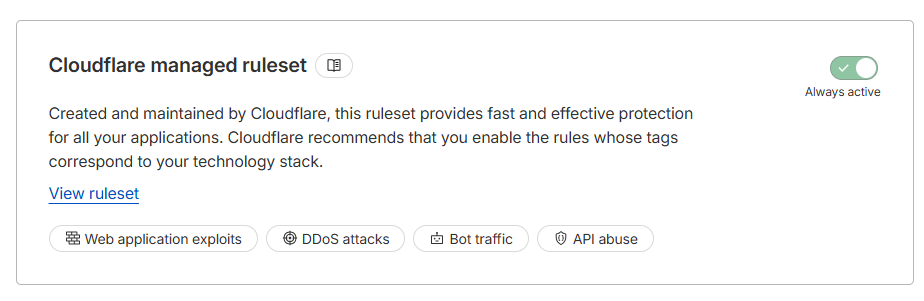
</p>

### Capa 2 — Reglas WAF personalizadas (5/5 usadas)

<p align="center">
  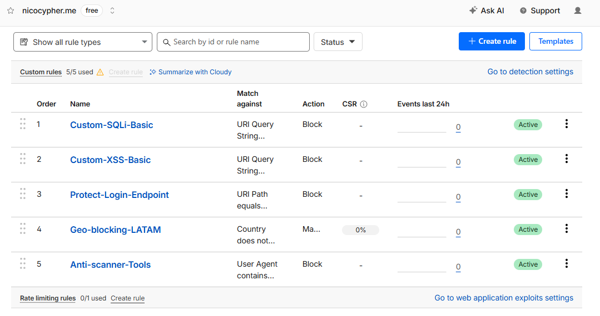
</p>
<p align="center"><em>Las 5 reglas personalizadas, todas <strong>Active</strong>.</em></p>

| # | Regla | Código (resumen) | Función / Protección |
|---|---|---|---|
| 1 | **Custom-SQLi-Basic** | `http.request.uri.query contains "UNION SELECT"` | Bloquea inyección SQL: detecta el patrón `UNION SELECT` usado para combinar consultas legítimas con maliciosas que extraen datos ocultos. |
| 2 | **Custom-XSS-Basic** | contiene `<script>`, `javascript:`, `onerror=`, `alert(` | Bloquea Cross-Site Scripting: evita que se inyecte código JavaScript capaz de robar cookies de sesión o credenciales. |
| 3 | **Protect-Login-Endpoint** | `http.request.uri.path equals ...` (ruta de login) | Protege el endpoint de autenticación de accesos no autorizados o fuerza bruta. |
| 4 | **Geo-blocking-LATAM** | `ip.geoip.country ne "PA"` | Bloqueo geográfico: restringe el acceso a países fuera de Panamá, reduciendo intentos maliciosos desde regiones sin razón legítima de conexión. |
| 5 | **Anti-scanner-Tools** | `http.user_agent contains "sqlmap"` (también `nikto`, `dirbuster`) | Detecta y corta escáneres automáticos identificados por su User-Agent, frenando el ruido antes de que el escaneo comience. |

### Capa 3 — Bot Fight Mode & Security Level

<table>
<tr>
<td width="50%">
<p align="center">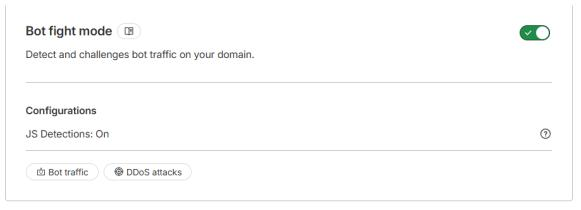</p>
<p align="center"><em><strong>Bot Fight Mode</strong> ON — fingerprinting de comportamiento (versión básica del plan Free).</em></p>
</td>
<td width="50%">
<p align="center">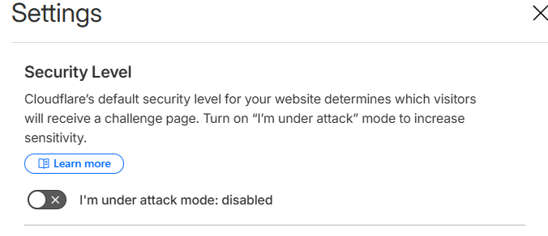</p>
<p align="center"><em><strong>"I'm Under Attack Mode"</strong> desactivado — se reserva para ataques DDoS activos, ya que activarlo preventivamente generaría fricción innecesaria a usuarios legítimos.</em></p>
</td>
</tr>
</table>

El **Challenge Passage** queda con su valor por defecto de 30 minutos.

<p align="center">
  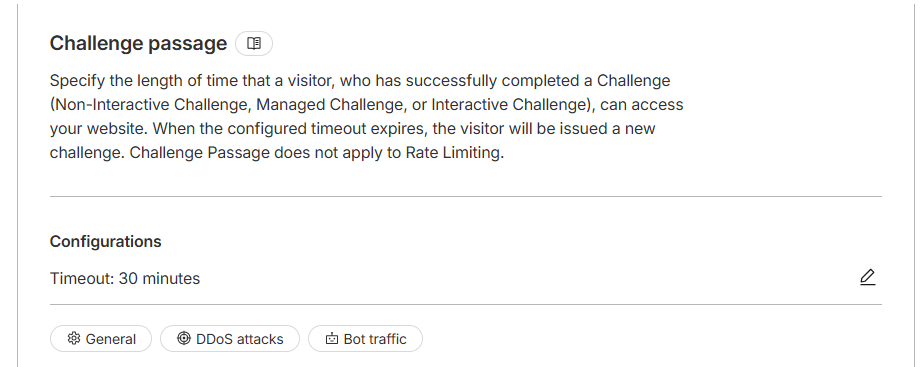
</p>

### Capa 4 — DDoS Protection & Analytics

<table>
<tr>
<td width="50%">
<p align="center">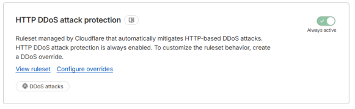</p>
<p align="center"><em><strong>HTTP DDoS Attack Protection</strong> — activo automáticamente, sensibilidad ajustada a <em>High</em> para el laboratorio.</em></p>
</td>
<td width="50%">
<p align="center">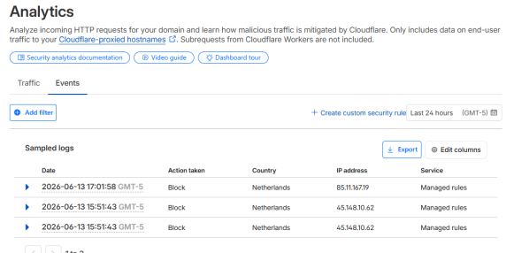</p>
<p align="center"><em><strong>Security → Events</strong>: bloqueos registrados en tiempo real (probados desde otra red / hotspot).</em></p>
</td>
</tr>
</table>

---

## 🔥 5. Prueba de fuego (validación del WAF)

Se probó la regla de **XSS** enviando la siguiente petición:

```
https://nicocypher.me/?buscar=<script>alert(1)</script>
```

El WAF bloquea la petición inmediatamente:

<p align="center">
  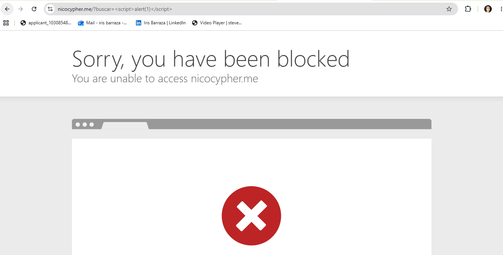
</p>
<p align="center"><em>Cloudflare bloquea el intento de XSS: "Sorry, you have been blocked".</em></p>

Al navegar de forma normal (sin *payload* malicioso), el sitio funciona sin fricción:

<table>
<tr>
<td width="50%">
<p align="center">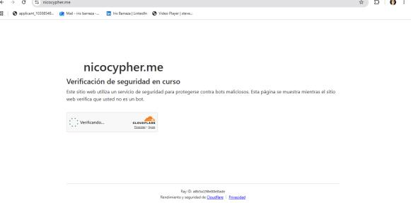</p>
</td>
<td width="50%">
<p align="center">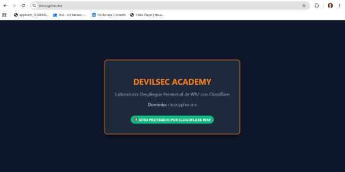</p>
</td>
</tr>
</table>
<p align="center"><em>Tráfico legítimo pasa sin bloqueos — sitio protegido por Cloudflare WAF.</em></p>

---

## ✅ Conclusión

La implementación de un WAF de Cloudflare representa una solución eficaz para fortalecer la seguridad de aplicaciones web frente a amenazas cada vez más sofisticadas. A través de la configuración de un dominio real, el uso del proxy de Cloudflare y la definición de reglas personalizadas, es posible mitigar ataques como inyecciones, escaneos automatizados y otras actividades maliciosas. Este proyecto demuestra la importancia de combinar herramientas tecnológicas con criterios técnicos adecuados para diseñar estrategias de defensa robustas, y evidencia el papel clave del WAF en la ciberseguridad moderna.

