# Windows 11 Hardening: Cifrado, Superficie de Ataque y Telemetría

## Contexto
Laboratorio de la asignatura Gestión de Almacenamiento de Información, Universidad Tecnológica de Panamá. El ejercicio consistió en tomar una máquina virtual Windows 11 recién instalada ("out-of-the-box") y aplicarle un proceso de endurecimiento (hardening) completo, validando el resultado con auditorías de red antes y después del proceso.

## Objetivo
Reducir la superficie de ataque de una estación de trabajo Windows 11 mediante tres frentes: cifrado de disco en reposo, cierre de servicios/puertos innecesarios, y mitigación de fuga de datos por telemetría — automatizando el proceso completo en un script de PowerShell reutilizable.

## Tecnologías
- Windows 11 (PowerShell, Administración de discos, Editor de directivas)
- BitLocker + TPM 2.0
- Nmap (auditoría de puertos)
- PowerShell scripting (`.ps1`)

## Metodología

El laboratorio se dividió en 4 fases:

1. **Auditoría de línea base** — estado inicial "out-of-the-box" del sistema.
2. **Ejecución del hardening** — aplicación de las medidas en 3 bloques (cifrado, servicios, privacidad).
3. **Automatización** — script `.ps1` que replica todo el proceso de forma repetible.
4. **Verificación final** — re-auditoría para confirmar el efecto de los cambios.

## Implementación

### Fase 1: Auditoría de línea base (el "antes")

Se identificaron los servicios expuestos por defecto con `netstat -an` y un escaneo Nmap dirigido:

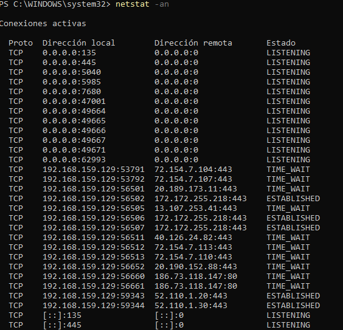
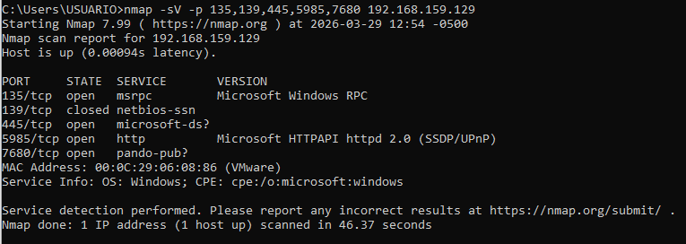

Se detectaron como críticos:
- **Puerto 445 (SMB)** — expuesto por defecto, riesgo de ejecución remota de código.
- **Puerto 135 (RPC)** — usado para Registro Remoto, facilita enumeración del sistema.
- **Puerto 5985 (WinRM)** — administración remota activa innecesariamente en una estación de trabajo.

También se exportó el listado completo de servicios activos para revisión:

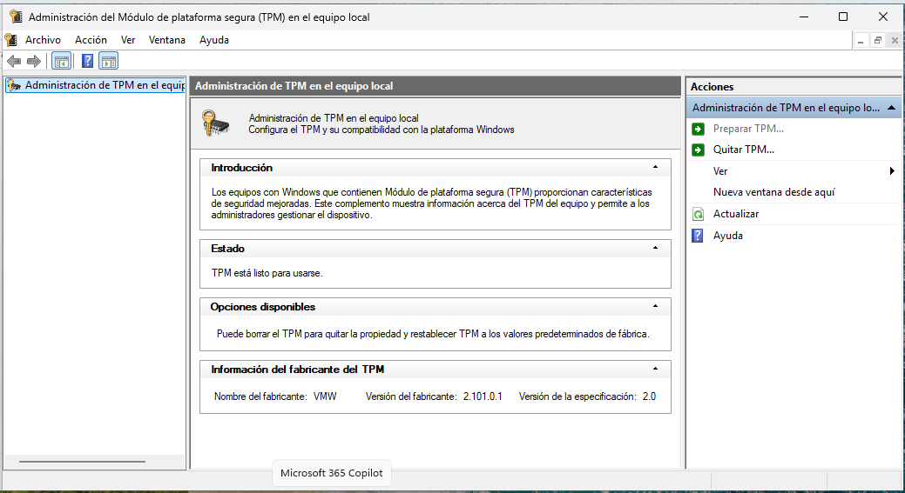

De ahí se identificaron **Print Spooler** (vulnerable a PrintNightmare, CVE-2021-34527), **Remote Registry** y los **servicios de Xbox** (innecesarios en un entorno corporativo, principio de mínima funcionalidad) como candidatos a deshabilitar.

En cuanto al almacenamiento, se confirmó mediante `Get-BitLockerVolume` que el disco principal no tenía cifrado activo (`Protection Status: Off`), y se verificó la disponibilidad del chip TPM:

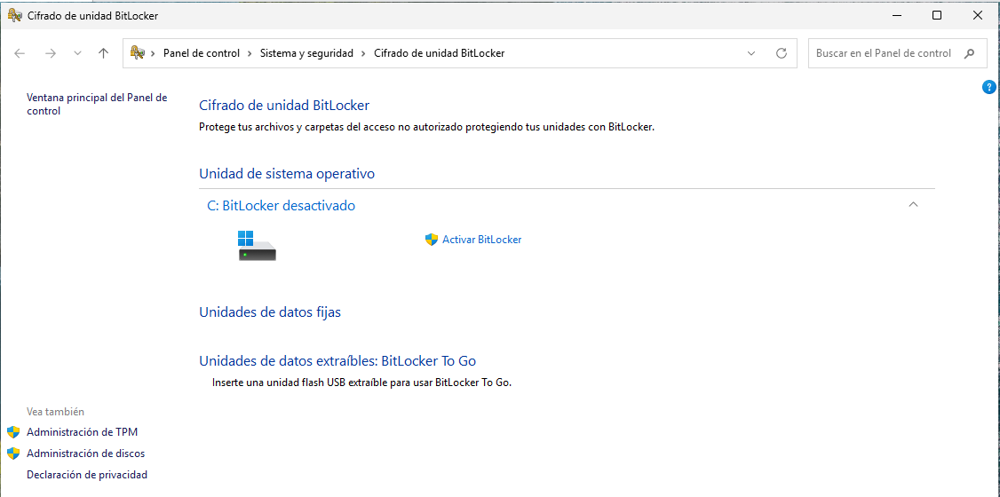
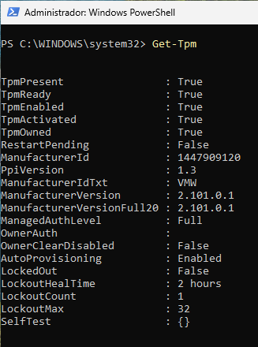

Por último, se auditó el panel de privacidad, encontrando la telemetría en nivel **'Full'** y el identificador de publicidad activo:

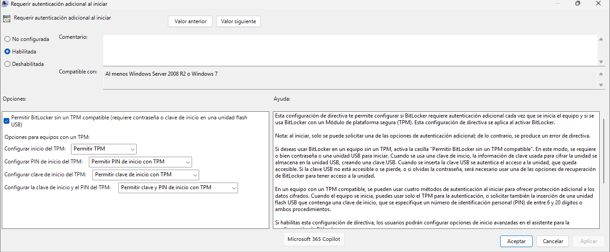

### Fase 2: Ejecución del hardening

**Bloque 1 — Cifrado de disco (BitLocker)**

Se verificó que el chip TPM estuviera listo y activo:

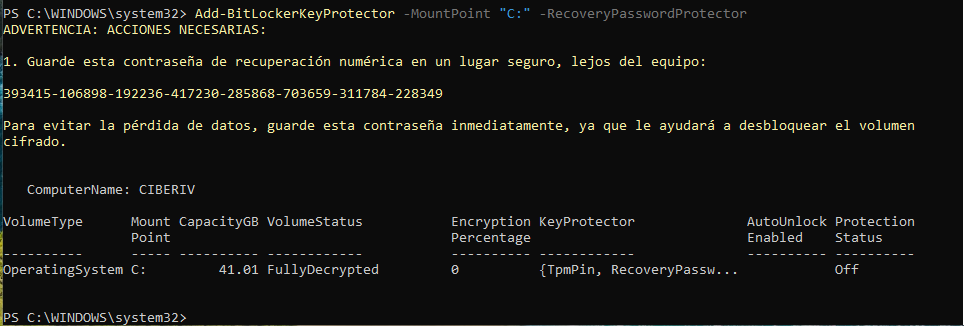

Se configuró la directiva **TPM+PIN** (autenticación adicional al inicio) antes de activar BitLocker, para evitar conflictos de directiva:

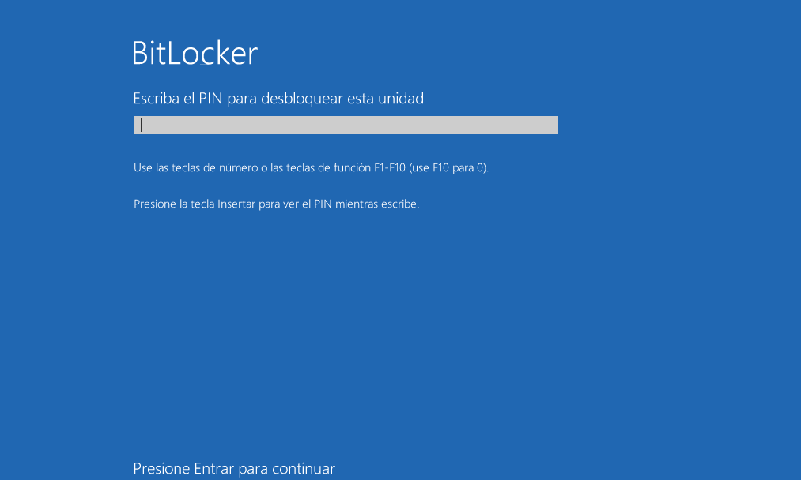

Se ejecutó `Enable-BitLocker` con cifrado AES-256 y protector TPM+PIN, y se añadió una clave de recuperación de respaldo con `Add-BitLockerKeyProtector` antes de reiniciar:

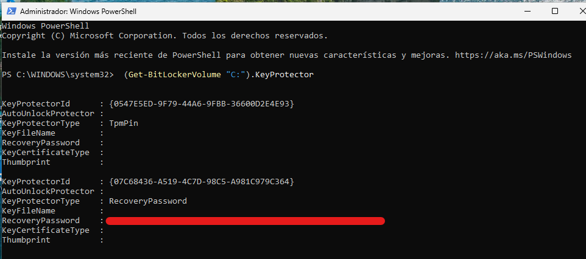

Al reiniciar, el sistema solicitó el PIN configurado para desbloquear la unidad:

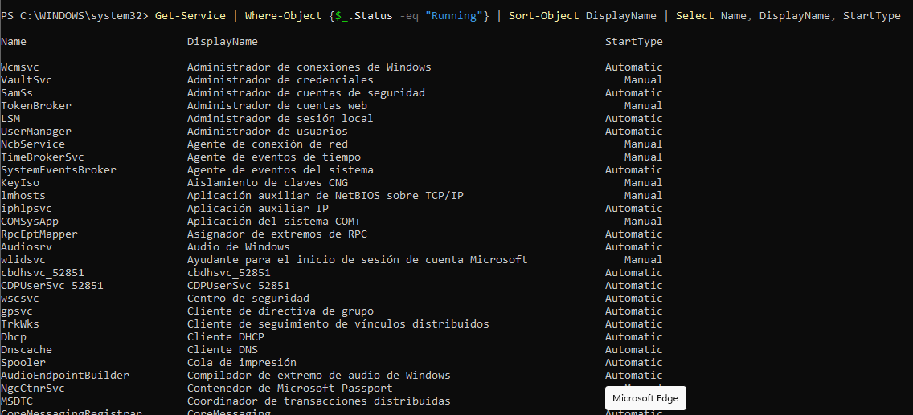

**Bloque 2 — Reducción de superficie: servicios de Windows**

Se listaron los servicios en ejecución y se exportó el resultado para su revisión:

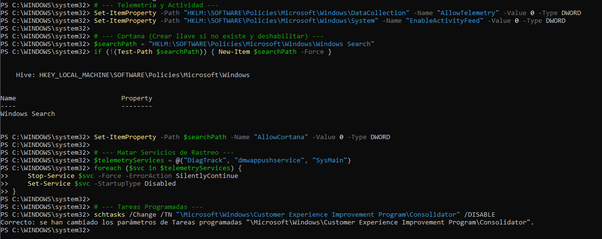
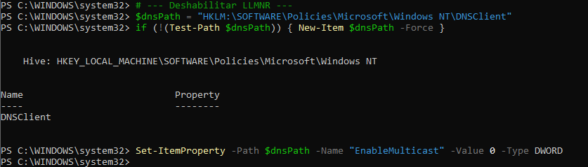

Se deshabilitaron los servicios identificados como innecesarios: **Remote Registry**, **Print Spooler**, **WinRM** y los servicios de **Xbox**, además de desactivar el protocolo **SMBv1**:

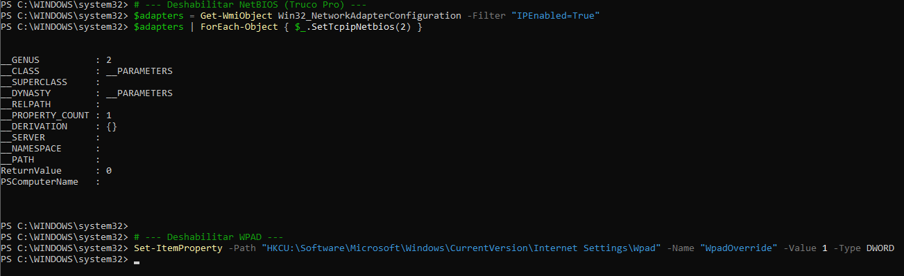

**Bloque 3 — Privacidad y telemetría**

Mediante llaves de registro se configuró la telemetría en **Nivel 0 (Security)**, se deshabilitó Cortana, se detuvieron servicios de rastreo (DiagTrack, dmwappushservice, SysMain), se desactivó la tarea programada de Customer Experience Improvement Program, y se deshabilitaron **LLMNR**, **NetBIOS** y **WPAD** para reducir vectores de ataque de resolución de nombres (relevante frente a ataques tipo Responder):

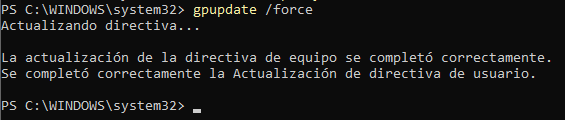

Se actualizaron las directivas del sistema para aplicar los cambios:

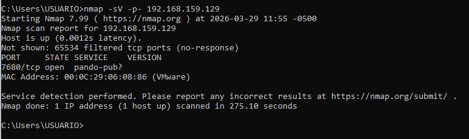

### Fase 3: Automatización (script `.ps1`)

Todo el proceso anterior se consolidó en un script de PowerShell (`Hardening.ps1`) que automatiza:
1. Deshabilitación de servicios peligrosos (`Spooler`, `RemoteRegistry`, `WinRM`, `SMB1`).
2. Ajuste de telemetría a Nivel 0.
3. Desactivación del identificador de publicidad.
4. Bloqueo de NetBIOS/LLMNR.
5. Verificación final del estado de BitLocker.

Esto garantiza que el hardening sea **repetible y libre de errores humanos** al aplicarlo en múltiples máquinas.

### Fase 4: Verificación final (el "después")

Se repitió el escaneo Nmap sobre la misma IP para confirmar la reducción de la superficie expuesta:

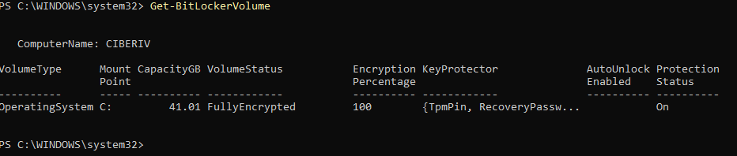

Y se verificó el estado de cada bloque aplicado:

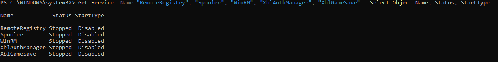
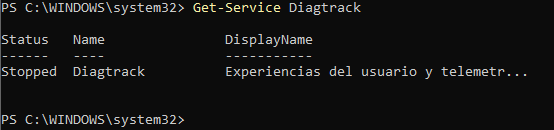

## Resultados

| Vector de ataque | Estado inicial | Estado final | Medida aplicada |
|---|---|---|---|
| Cifrado de disco | Desactivado | Activo (AES-256) | Configuración de BitLocker con PIN |
| Puerto 445 (SMB) | Abierto | Filtrado/Cerrado | Desactivación de SMBv1 y servicios |
| Telemetría | Completa | Nivel 0 (Mínimo) | Modificación de llaves de registro |
| Resolución de nombres | Activa (LLMNR) | Desactivada | Hardening de DNS Client y NetBIOS |

El escaneo Nmap final mostró una reducción drástica de puertos expuestos frente al estado inicial, confirmando la efectividad de las medidas aplicadas.

## Aprendizaje
- El hardening efectivo combina tres capas independientes (cifrado, superficie de red, privacidad) que se refuerzan entre sí.
- El principio de mínima funcionalidad (deshabilitar todo lo no esencial, como servicios de Xbox en una estación de trabajo) reduce superficie de ataque sin afectar la operación real del sistema.
- Automatizar el proceso en un script no es solo comodidad: garantiza consistencia y auditar/repetir el hardening en múltiples equipos sin errores manuales.
- Los protectores de BitLocker (TPM+PIN) y su clave de recuperación deben gestionarse con el mismo cuidado que cualquier credencial crítica — nunca deben quedar expuestos en documentación pública.
