# Self-Signed TLS with OpenSSL

## Context
Academic laboratory focused on understanding the process of creating and configuring TLS certificates using OpenSSL.

## Objective
Implement encrypted communication on a web server using a self-signed certificate.

## Technologies
- OpenSSL
- Apache / Nginx
- TLS

## Implementation

### Generation of Private Key and Self-Signed Certificate
A self-signed certificate with SAN (Subject Alternative Name) was generated directly using OpenSSL, including `example.local` and `127.0.0.1` as alternative names.

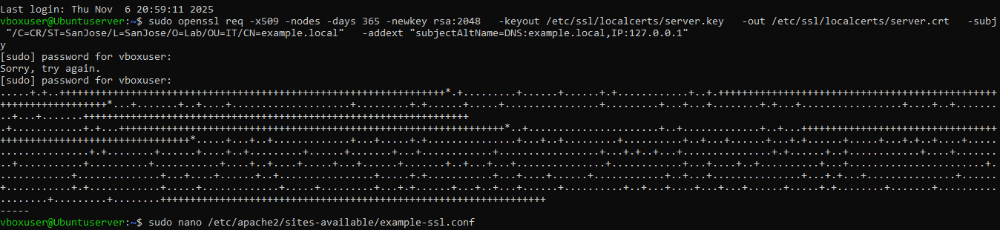

### Web Server Configuration for TLS

**Apache**

Installation and enablement of the SSL module:

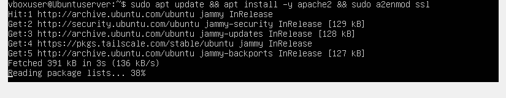
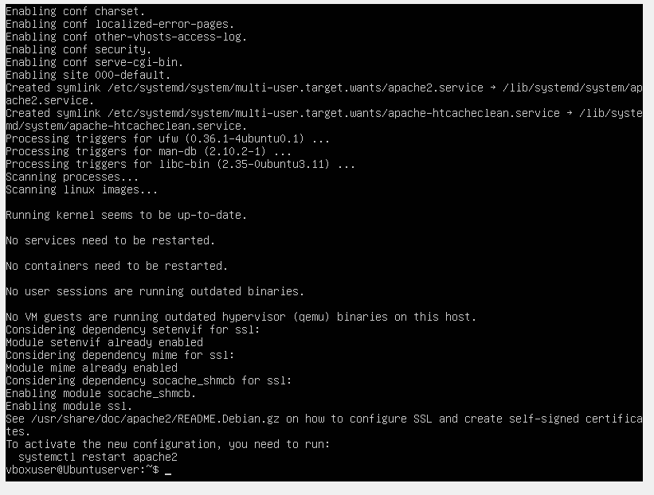

Creation of the HTTPS VirtualHost pointing to the generated certificate:

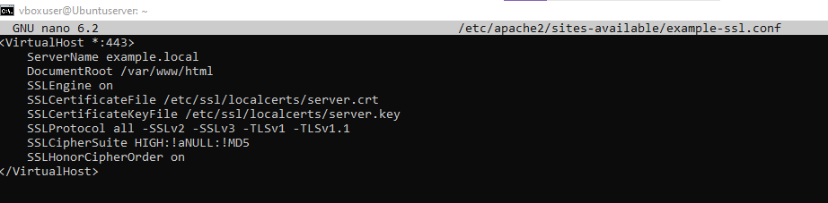

Site enablement and service reload:

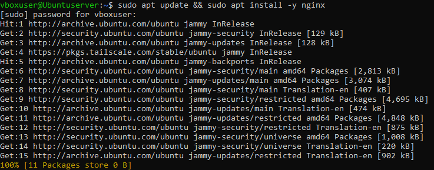

**Nginx**

Installation of Nginx:

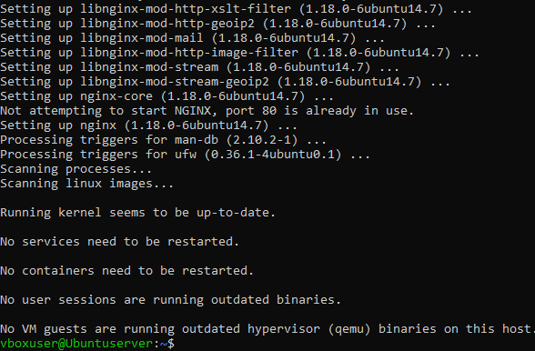
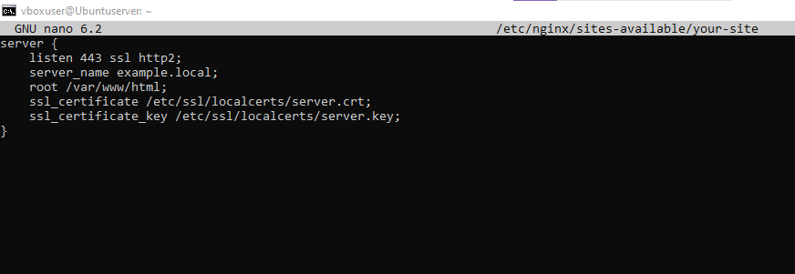

Creation of the HTTPS server block:

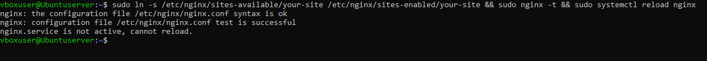

Site activation and service reload:

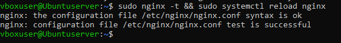

## Testing
TLS encryption and browser behavior regarding untrusted certificates were verified.

Test with `curl` (ignoring certificate validation due to being self-signed):

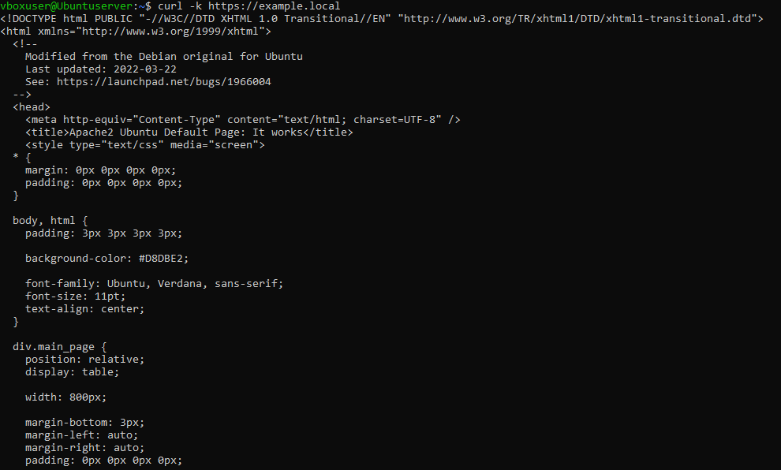

Verification of certificate details (subject, issuer, validity dates, SAN) with `openssl s_client`:

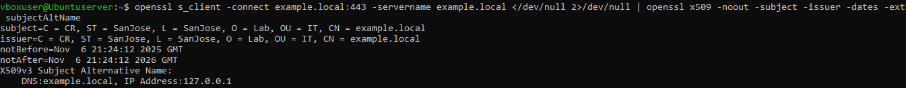

## Optional: Custom Certificate Authority (CA)

As an additional exercise, a local CA was created and the server certificate was signed with it instead of using a direct self-signed certificate, adding SAN extensions via a configuration file.

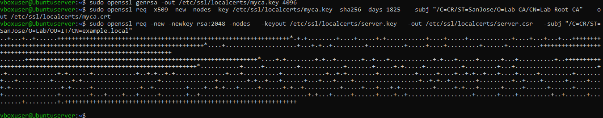
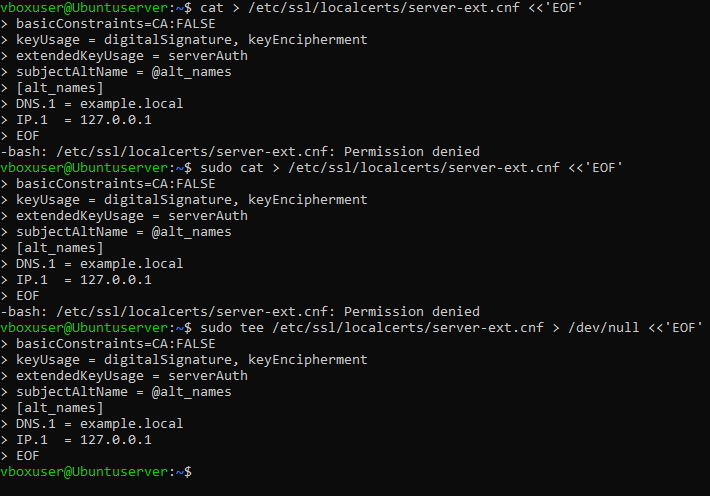
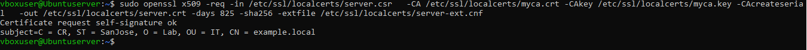

> **Note:** when creating the extensions file with `sudo cat > file`, a permission denied error was encountered (the `>` redirection executes with current shell permissions, not `sudo`). The solution was using `sudo tee file`, which writes the content with root privileges without failing redirection.

## Key Takeaways
Understanding certificate workflow, TLS trust models, and security warnings.